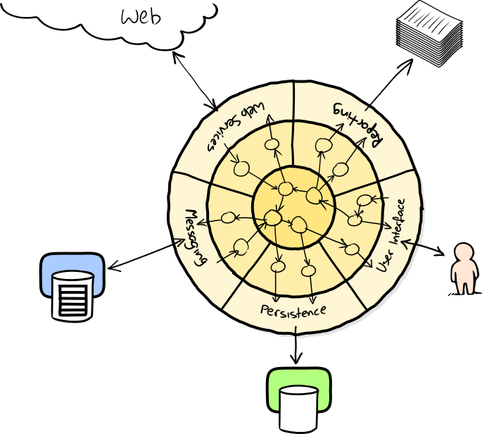

# Einstieg

## Softwaredebakel

#### VBS

- [Schweizer Armee ohne krisensichere Logistik bis 2035](https://www.srf.ch/news/schweiz/militaerische-it-projekte-schweizer-armee-ohne-krisensichere-logistik-bis-2035)

- [Armee-Debakel: 300-Millionen-Projekt seit Monaten suspendiert](https://www.srf.ch/news/schweiz/neue-luftraumueberwachung-armee-debakel-300-millionen-projekt-seit-monaten-suspendiert)

#### Kantonsverwaltung
 
- [Wegen fehlerhafter Software braucht es mehr Haftplätze](https://www.srf.ch/news/schweiz/it-probleme-im-kanton-bern-wegen-fehlerhafter-software-braucht-es-mehr-haftplaetze)

#### Polizei

- [Berner Polizisten beklagen sich über die neue IT](https://www.inside-it.ch/berner-polizisten-beklagen-sich-ueber-die-neue-it-20220722)

#### Crowdstrike

- [Der Tag, an dem die IT weltweit verrückt spielte – ein Überblick](https://www.srf.ch/news/international/crowdstrike-softwarefehler-der-tag-an-dem-die-it-weltweit-verrueckt-spielte-ein-ueberblick)

## Kundenorientierung

**Software soll den Kunden Mehrwert bringen**

- Software soll stabil laufen
- Neue Features sollten schnell umgesetzt und nutzbar sein
- Softwaresysteme werden immer komplexer

## Teamarbeit

**Mehrere Personen arbeiten am selben Softwareprojekt**

- Versionsverwaltung wird verwendet (Git, SVN)
- Konflikte entstehen und sind aufwendig

## Ab 1961: Margaret Hamilton, Apollo Guidance Computer

 

## 2001: Manifesto for Agile Software Development

* Individuals and interactions over processes and tools
* Working software over comprehensive documentation
* Customer collaboration over contract negotiation
* Responding to change over following a plan

https://agilemanifesto.org/

## Software Engineering / Software Architecture

> Software engineering is the application of an empirical, scientific approach to finding efficient, economic solutions to practical problems in software

(Farley, 2022, S.4)

> The goal of software architecture is to minimize the human resources required to build and maintain the required system

(Martin, 2018)

Übergang zwischen Software Entwicklung und Software Architektur ist fliessend

## Learning

- Iteratives und inkrementelles Arbeiten
- Feedback
- Empirisches und experimentelles Arbeiten

(vgl. Farley, 2022, S.4)

## Managing Complexity

- Modularity & Separation of Concerns
- Cohesion & Coupling
- Abstraction

(vgl. Farley, 2022, S.5)

## Production Is Not Our Problem

- Softwareentwicklung ist meistens Kreativarbeit
- Die Herausforderung der "Produktion" existiert kaum

## Space X Starship

[How Not to Land an Orbital Rocket Booser, 2017](https://www.youtube.com/watch?v=bvim4rsNHkQ)
[WOW! Watch SpaceX Catch A Starship Booster In Air, 2024](https://www.youtube.com/watch?v=NpjLfUoiT_w)

Finanzierung: **ca 3 Mrd. Dollar**

Apollo-Programm: 1958 bis 1969, inflationsbereinigt: **163 Mrd. Dollar** (ohne Mercury und Gemini)

# Lernen


(Richards, 2021, S.29)

## Iteratives und inkrementelles Arbeiten


## Iterationen


## Embrace Change


### Extreme Programming


## Feedback 

### CI/CD


### Continuous Integration

- **Kein Branching**, alle Änderungen werden von allen Teammitgliedern **mehrmals täglich** in den Master Branch eingecheckt.
- Dieser Branch ist **jederzeit lauffähig**
- Dadurch werden die **Releases vereinfacht**
- Eine sehr hohe, **automatische Testabdeckung** ist zwingend

### Continuous Deployment

- Ziel: **Releases werden vereinfacht**
- **Time to market ist kürzer**, neue Features sind sofort verfügbar
- Durch automatisierte Deployments ist der Aufwand initial höher, anschliessend jedoch sehr klein
- **Higher quality**, **Better products**
- Kaum mehr Release-Stress, **Happier teams**

https://www.continuousdelivery.com/

[Modern Software Engineering](https://www.amazon.com/Modern-Software-Engineering-Discipline-Development/dp/0137314914)

### Deployment Pipelines


(Jez Humble, David Farley (2010): Continuous Delivery)

---


(Jez Humble, David Farley (2010): Continuous Delivery)

---


--- 

- [Youtube: Continous Delivery - Deployment Pipelines](https://www.youtube.com/watch?v=x9l6yw1PFbs&list=PLwLLcwQlnXBzhxIXSbtDPX78zYTgvST0B)
- Jez Humble, David Farley (2010): Continuous Delivery: Reliable Software Releases through Build, Test, and Deployment
  Automation, Addison-Wesley Signature Series (Fowler)


## Empirisches und experimentelles Arbeiten

# Kommunikation

## Domain Driven Design

## UML Klassendiagramm


[PlantUML](https://www.plantuml.com/)

## UML Klassendiagramm


## PlantUML

```
@startuml
class Konto {
    bezeichnung
    saldo()
    einzahlen(betrag)
}

class Kunde {
}

class Privatkunde {
    vorname
    nachname
}

class Geschäftskunde {
    firmenname
}

class Adresse {
}

Kunde <|-- Privatkunde
Kunde <|-- Geschäftskunde

Privatkunde "0..*" -- "1" Adresse
Geschäftskunde "0..*" -- "1" Adresse

Konto "1..*" -- "1..*" Kunde
@enduml
```

## C4 Model


https://c4model.com/

----


----


## Architectural Decision Records

```markdown
# <!-- short title, representative of solved problem and found solution -->

## Context and Problem Statement

## Considered Options

## Decision Outcome

### Consequences
```
- https://github.com/adr/madr/blob/4.0.0/template/adr-template-bare-minimal.md
- https://github.com/adr/madr/blob/4.0.0/template/adr-template-bare.md

### Templates

- Nygard: https://github.com/joelparkerhenderson/architecture-decision-record/blob/main/locales/en/templates/decision-record-template-by-michael-nygard/index.md
- MADR: https://github.com/adr/madr/blob/4.0.0/template/adr-template.md

### Tools

- https://github.com/npryce/adr-tools
- https://github.com/opinionated-digital-center/pyadr

# Komplexität

## Modularity & Separation of Concerns

## Testing

> The hardest single part of building a software system is deciding precisely what to build.

– Fred Brooks, The mythical man-month

---


https://cucumber.io/docs/bdd/

## Cohesion & Coupling


## Abstraction


# Architekturen


## Schichtenarchitektur


## Ports and Adapters


[growing-object-oriented-software.com](https://www.martinfowler.com/microservices/)

## Traditional Monolithic Design


## Schichtenarchitektur im Client Server Modell


## Microservices


[martinfowler.com/articles/microservices.html](https://www.martinfowler.com/articles/microservices.html)

## Microservices

- Maximale Skalierbarkeit
- Einzelne Services können von **kleinen[^1]** Teams **unabhängig entwickelt und deployed** werden
- Bessere Wart- und Erweiterbarkeit
- Unterschiedliche Technologien können eingesetzt werden
- Kommunikation nicht trivial
- Höhere Wahrscheinlichkeit eines Ausfalls
- **Hohe Komplexität**

[^1]: ["We try to create teams that are no larger than can be fed by two pizzas"](https://docs.aws.amazon.com/whitepapers/latest/introduction-devops-aws/two-pizza-teams.html)

## Monolith First

- Vorsicht vor [Cargo-Kult](https://de.wikipedia.org/wiki/Cargo-Kult): Amazon, Google, Meta etc. haben heute andere
  Herausforderungen als Startups
- Technologien oder Architekturen wählen, "weil Google macht das auch so" ist ein schlechter Grund
  
  [martinfowler.com/bliki/MonolithFirst.html](https://www.martinfowler.com/bliki/MonolithFirst.html)

# Quellen

Farley, 2022
: David Farley (2022): Modern Software Engineering: Doing What Works to Build Better Software Faster, Addison-Wesley

Martin, 2018
: Robert C. Martin (2018): Clean Architecture: A Craftman's Guide to Software Structure and Design, Prentice Hall

Richards, 2021
: Mark Richards, Neal Ford (2021): Handbuch moderner Softwarearchitektur: Architekturstile, Patterns und Best 
Practices, O'Reilly, 978-3-96009-149-3
