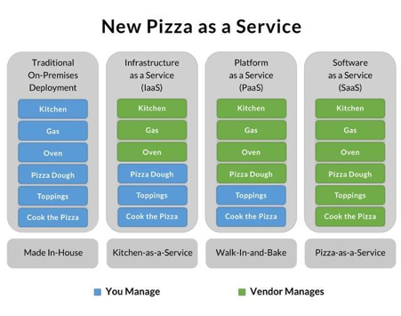
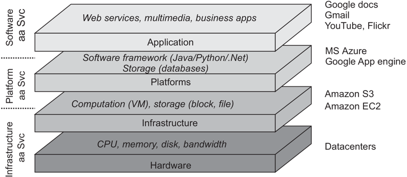

# Einstieg

## Internet of Bugs


---


---

{ width=50% }

---

- EJPD: [Kostenexplosion bei IT-Projekt: Finanzdelegation schlägt Alarm](https://www.srf.ch/news/schweiz/departement-von-beat-jans-kostenexplosion-bei-it-projekt-finanzdelegation-schlaegt-alarm)
- VBS: [Schweizer Armee ohne krisensichere Logistik bis 2035](https://www.srf.ch/news/schweiz/militaerische-it-projekte-schweizer-armee-ohne-krisensichere-logistik-bis-2035),
[Armee-Debakel:300-Millionen-Projekt seit Monaten suspendiert](https://www.srf.ch/news/schweiz/neue-luftraumueberwachung-armee-debakel-300-millionen-projekt-seit-monaten-suspendiert)

- Kantonsverwaltung: [Wegen fehlerhafter Software braucht es mehr Haftplätze](https://www.srf.ch/news/schweiz/it-probleme-im-kanton-bern-wegen-fehlerhafter-software-braucht-es-mehr-haftplaetze)
- Polizei: [Berner Polizisten beklagen sich über die neue IT](https://www.inside-it.ch/berner-polizisten-beklagen-sich-ueber-die-neue-it-20220722)
- Crowdstrike: [Der Tag, an dem die IT weltweit verrückt spielte – ein Überblick](https://www.srf.
  ch/news/international/crowdstrike-softwarefehler-der-tag-an-dem-die-it-weltweit-verrueckt-spielte-ein-ueberblick)

## Ab 1961: Margaret Hamilton, Apollo Guidance Computer

 

## Anforderungen an (moderne) Software

> - the problems of achieving sufficient reliability in the data systems which are becoming increasingly integrated into
    the central activities of modern society
> - the difficulties of meeting schedules and specifications on large software projects
> - the education of software (or data systems) engineers

-- SOFTWARE ENGINEERING, Report on a conference sponsored by the NATO SCIENCE COMMITTEE, Garmisch, Germany, 7th to 11th
October 1968 http://homepages.cs.ncl.ac.uk/brian.randell/NATO/nato1968.PDF

## Agiles Manifest

* **Individuals and interactions** over processes and tools
* **Working software** over comprehensive documentation
* **Customer collaboration** over contract negotiation
* **Responding to change** over following a plan

2001, https://agilemanifesto.org/

## Anforderungen an Software

**Software soll den Kunden Mehrwert bringen**

- Software soll zuverlässig sein
- Neue Features sollten schnell umgesetzt und nutzbar sein

### Zuverlässigkeit

- Hohe Verfügbarkeit
- Skalierbarkeit
- Im Katastrophenfall sollen die Systeme schnell wiederhergestellt werden können
- Soll funktionieren, auch wenn Teile des Systems Offline sind (Resilienz)
- Kostengünstig
- Einfach
- Updates müssen einfach eingespielt werden können
- 
## Softwarekrise

**Softwaresysteme werden immer komplexer**

> “[The major cause of the software crisis is] that the machines have become several orders of magnitude more powerful!
> To put it quite bluntly: as long as there were no machines, programming was no problem at all; when we had a few weak
> computers, programming became a mild problem, and now we have gigantic computers, programming has become an equally
> gigantic problem.”

-- Edsger Dijkstra: The Humble Programmer https://www.cs.utexas.edu/~EWD/ewd03xx/EWD340.PDF, 1972


## Software Engineering vs Software Architecture vs Software Development

> Software engineering is the application of an empirical, scientific approach to finding efficient, economic solutions
> to practical problems in software

(Farley, 2022, S.4)

> The goal of software architecture is to minimize the human resources required to build and maintain the required
> system

(Martin, 2018)

- Übergang zwischen Software Entwicklung, Software Architektur und Softwareentwicklung ist fliessend.
- Grundsätzlich sollen alle Beteiligten in allen Bereichen bewandert sein.

## Kommunikation

**Mehrere Personen arbeiten am selben Softwareprojekt**

- Fachkräftemangel
- Ausbildung ist sehr herausfordernd
- Wissenstransfer

## Lernen

- Iteratives und inkrementelles Arbeiten
- Feedback
- Empirisches und experimentelles Arbeiten

(vgl. Farley, 2022, S.4)

## Komplexität "managen"

- Modularity & Separation of Concerns
- Cohesion & Coupling
- Abstraction

(vgl. Farley, 2022, S.5)

## Production Is Not Our Problem

- Softwareentwicklung ist meistens Kreativarbeit
- Die Herausforderung der "Produktion" existiert kaum

## Space X Starship

[How Not to Land an Orbital Rocket Booser, 2017](https://www.youtube.com/watch?v=bvim4rsNHkQ)
[WOW! Watch SpaceX Catch A Starship Booster In Air, 2024](https://www.youtube.com/watch?v=NpjLfUoiT_w)

Finanzierung: **ca 3 Mrd. Dollar**

Apollo-Programm: 1958 bis 1969, inflationsbereinigt: **163 Mrd. Dollar** (ohne Mercury und Gemini)

# Generative KI in der Software-Entwicklung und Bildung

- LLMs können inherent nur durchschnittliche Antworten generieren
- Je nach Fragestellung kann das hilfreich sein oder auch nicht
- Die Kontextfenster sind oft zu klein für Software-Architektur
- Längere generierte Texte scheinen oft auf den ersten Blick sehr gut, bei genauerer
  Betrachtung aber inhaltsleer, inkorrekt und übermässig umfangreich.
- Offensichtlich generierte Texte stossen beim Empfänger oft auf starke Ablehnung.
- Bei Code werden oft Features implementiert, die nicht gefragt wurden oder übermässig komplizierte Lösungen entworfen.
- Der Nutzen durch die schnelle Code-Generierung wird durch längeres Debugging und Refactoring oft zunichtegemacht.
- Wenn die inhaltliche Korrektheit wichtig ist (was sie im Softwareengineering eigentlich immer ist), muss der KI-Output
  vollständig überprüft werden. Voraussetzung dafür ist ein vollständiges Verstehen des Inhalts.
- Datenschutztechnisch ist die Verwendung von LLMs sehr heikel.
- Der Lerneffekt ist gering, echtes Verständnis entsteht, wenn man sich intensiv mit einer Materie auseinandersetzt.
- Um auf dem Arbeitsmarkt erfolgreich zu sein, ist kritisches Denken notwendig.
- Ein Studium ist das ideale Umfeld, dies zu lernen.

vgl. https://www.golem.de/news/produktivitaetssabotage-ki-muell-kostet-unternehmen-millionen-2509-200417.html

## Konkrete Empfehlungen

- KI verwenden für:
    - Analyse von Dokumenten(-sammlungen)
    - Boilerplate Code
    - Formulierungen und Textkorrektur
    - Entwurf von Lösungsstrategien
- KI nicht verwenden für:
    - Schreiben von ganzen Dokumenten, Arbeiten, E-Mails
    - Schreiben von ganzen Funktionen und Klassen
    - Entwurf von ganzen Architekturen


# Lernen


(Richards, 2021, S.29)

## Iteratives und inkrementelles Arbeiten


## Iterationen


## Embrace Change


### Extreme Programming


## Feedback

### CI/CD


### Continuous Integration

- **Kein Branching**, alle Änderungen werden von allen Teammitgliedern **mehrmals täglich
  ** in den Master Branch eingecheckt.
- Dieser Branch ist **jederzeit lauffähig**
- Dadurch werden die **Releases vereinfacht**
- Eine sehr hohe, **automatische Testabdeckung** ist zwingend

### Continuous Deployment

- Ziel: **Releases werden vereinfacht**
- **Time to market ist kürzer**, neue Features sind sofort verfügbar
- Durch automatisierte Deployments ist der Aufwand initial höher, anschliessend jedoch sehr klein
- **Higher quality**, **Better products**
- Kaum mehr Release-Stress, **Happier teams**

https://www.continuousdelivery.com/

[Modern Software Engineering](https://www.amazon.com/Modern-Software-Engineering-Discipline-Development/dp/0137314914)

### Deployment Pipelines


---


(Jez Humble, David Farley (2010): Continuous Delivery)

---


### Kubernetes


([Wikipedia](https://de.wikipedia.org/wiki/Kubernetes#/media/Datei:Kubernetes.png))

---

```yaml
apiVersion: apps/v1
kind: Deployment
metadata:
  name: nginx-deployment
  labels:
    app: nginx
spec:
  replicas: 3
  selector:
    matchLabels:
      app: nginx
  template:
    metadata:
      labels:
        app: nginx
    spec:
      containers:
        - name: nginx
          image: nginx:1.14.2
          ports:
            - containerPort: 80
```

(https://kubernetes.io/docs/concepts/workloads/controllers/deployment/)

### Quellen

- [Youtube: Continous Delivery - Deployment Pipelines](https://www.youtube.com/watch?v=x9l6yw1PFbs&list=PLwLLcwQlnXBzhxIXSbtDPX78zYTgvST0B)
- Jez Humble, David Farley (2010): Continuous Delivery: Reliable Software Releases through Build, Test, and Deployment
  Automation, Addison-Wesley Signature Series (Fowler)

## Empirisches und experimentelles Arbeiten

> Rule 1. You can't tell where a program is going to spend its time. Bottlenecks occur in surprising places, so don't try to second guess and put in a speed hack until you've proven that's where the bottleneck is.
> 
> Rule 2. Measure. Don't tune for speed until you've measured, and even then don't unless one part of the code 
> overwhelms the rest.
>
> Rule 3. Fancy algorithms are slow when n is small, and n is usually small. Fancy algorithms have big constants. 
> Until you know that n is frequently going to be big, don't get fancy. (Even if n does get big, use Rule 2 first.)
>
> Rule 4. Fancy algorithms are buggier than simple ones, and they're much harder to implement. Use simple algorithms 
> as well as simple data structures.
> 
-- Rob Pike http://www.catb.org/~esr/writings/taoup/html/ch01s06.html

# Kommunikation

## Domain Driven Design

## UML Klassendiagramm


[PlantUML](https://www.plantuml.com/)

## UML Klassendiagramm


## PlantUML

```
@startuml
class Konto {
    bezeichnung
    saldo()
    einzahlen(betrag)
}

class Kunde {
}

class Privatkunde {
    vorname
    nachname
}

class Geschäftskunde {
    firmenname
}

class Adresse {
}

Kunde <|-- Privatkunde
Kunde <|-- Geschäftskunde

Privatkunde "0..*" -- "1" Adresse
Geschäftskunde "0..*" -- "1" Adresse

Konto "1..*" -- "1..*" Kunde
@enduml
```

## C4 Model


https://c4model.com/

----


----


## Architectural Decision Records

```markdown
# <!-- short title, representative of solved problem and found solution -->

## Context and Problem Statement

## Considered Options

## Decision Outcome

### Consequences
```

- https://github.com/adr/madr/blob/4.0.0/template/adr-template-bare-minimal.md
- https://github.com/adr/madr/blob/4.0.0/template/adr-template-bare.md

### Templates

-

Nygard: https://github.com/joelparkerhenderson/architecture-decision-record/blob/main/locales/en/templates/decision-record-template-by-michael-nygard/index.md

- MADR: https://github.com/adr/madr/blob/4.0.0/template/adr-template.md

### Tools

- https://github.com/npryce/adr-tools
- https://github.com/opinionated-digital-center/pyadr

# Komplexität

## Modularity & Separation of Concerns

## Testing

> The hardest single part of building a software system is deciding precisely what to build.

– Fred Brooks, The mythical man-month

---


https://cucumber.io/docs/bdd/

## Cohesion & Coupling


## Abstraction

# Architekturen

## Schichtenarchitektur


## Ports and Adapters


[growing-object-oriented-software.com](https://www.martinfowler.com/microservices/)

## Traditional Monolithic Design


## Schichtenarchitektur im Client Server Modell


## Microservices

- Maximale Skalierbarkeit
- Einzelne Services können von **kleinen[^1]** Teams **unabhängig entwickelt und deployed** werden
- Bessere Wart- und Erweiterbarkeit
- Unterschiedliche Technologien können eingesetzt werden
- Kommunikation nicht trivial
- Höhere Wahrscheinlichkeit eines Ausfalls
- **Hohe Komplexität**

[martinfowler.com/articles/microservices.html](https://www.martinfowler.com/articles/microservices.html)
[^1]: ["We try to create teams that are no larger than can be fed by two pizzas"](https://docs.aws.amazon.com/whitepapers/latest/introduction-devops-aws/two-pizza-teams.html)

## Monolith First

- Vorsicht vor [Cargo-Kult](https://de.wikipedia.org/wiki/Cargo-Kult): Amazon, Google, Meta etc. haben heute andere
  Herausforderungen als Startups
- Technologien oder Architekturen wählen, "weil Google macht das auch so" ist ein schlechter Grund
  
  [martinfowler.com/bliki/MonolithFirst.html](https://www.martinfowler.com/bliki/MonolithFirst.html)

## Event Driven Architecture

## Reactive Systems


## Fallstudie


# Cloud Computing

> The entire history of software engineering is that of the rise in levels of abstraction.

-- Grady Booch

---



## Abstractions


(VanSteen, 2017, S. 30)

## XaaS


## What is a Cloud Native application?

A "cloud native" application, like all native species, has adapted and evolved to be maximally efficient in its
environment: the cloud.

The cloud is a harsher environment for applications than those of the past, in particular, than the idealistic
environment of a dedicated single node system.

In the cloud, an application becomes distributed. Thus, it is forced to be resilient to hardware/network
unpredictability and unreliability, i.e., from varying performance to all-out failure.

https://www.reactiveprinciples.org/cloud-native/index.html

---

The bad news is that ensuring responsiveness and reliability in this harsh environment is difficult.

The good news is that the applications we build after embracing this environment better match how the real world
actually works.

This in turn, provides better experiences for our users, whether humans or software.

https://www.reactiveprinciples.org/cloud-native/index.html

---

The constraints of the cloud environment, that make up the "cloud operating model," include:

- Applications are limited in the ability to scale vertically on commodity hardware which typically leads to having many
  isolated autonomous services (often called microservices).
- All inter-service communication takes place over unreliable networks.
- You must operate under the assumption that the underlying hardware can fail or be restarted or moved at any time.
- The services need to be able to detect and manage failure of their peers—including partial failures.
- Strong consistency and transactions are expensive. Because of the coordination required, it is difficult to make
  services that manage data available, performant, and scalable.

---

Therefore, a Cloud Native application is designed to leverage the cloud operating model.

It is predictable, decoupled from the infrastructure, right-sized for capacity, and enables tight collaboration between
development and operations.

It can be decomposed into loosely-coupled, independently-operating services that are resilient from failures, driven by
data, and operate intelligently across geographic regions.

---

While Cloud Native applications always have a clean separation of state and compute, there are two major classes of
Cloud Native applications: stateful and stateless.

Each class addresses and excels in a different set of use-cases; non-trivial modern Cloud Native applications are
usually a combination and composition of the two.

# Quellen

Farley, 2022
: David Farley (2022): Modern Software Engineering: Doing What Works to Build Better Software Faster, Addison-Wesley

Martin, 2018
: Robert C. Martin (2018): Clean Architecture: A Craftman's Guide to Software Structure and Design, Prentice Hall

Richards, 2021
: Mark Richards, Neal Ford (2021): Handbuch moderner Softwarearchitektur: Architekturstile, Patterns und Best Practices,
O'Reilly, 978-3-96009-149-3
