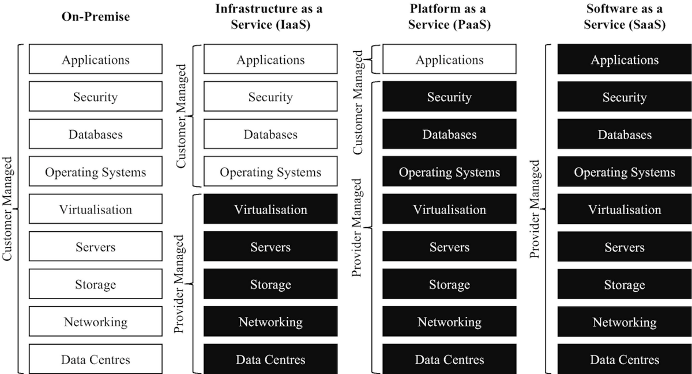
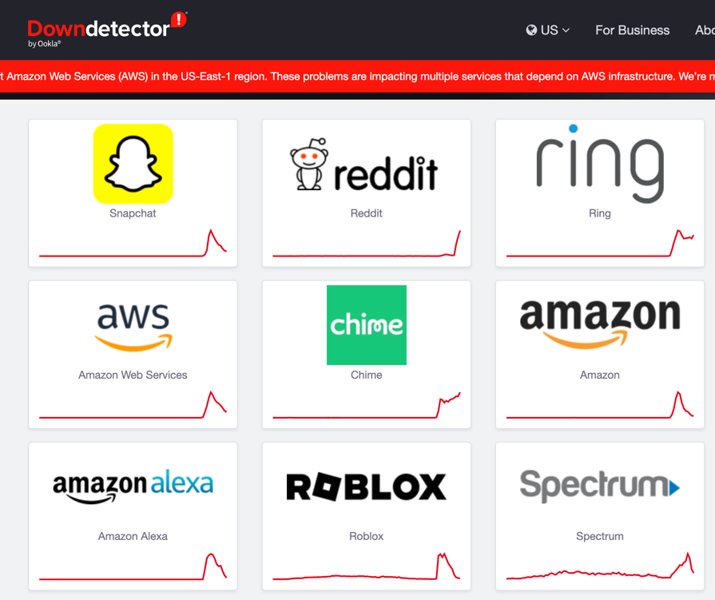

# Cloud Computing


> The entire history of software engineering is that of the rise in levels of abstraction.

-- Grady Booch

---

> Cloud computing is a model for enabling ubiquitous, convenient, on-demand network access to a shared pool of
> configurable computing resources (e.g., networks, servers, storage, applications, and services) that can be rapidly
> provisioned and released with minimal management effort or service provider interaction. This cloud model is composed
> of
> five essential characteristics, three service models, and four deployment models.

https://csrc.nist.gov/pubs/sp/800/145/final

## Essential Characteristics:

- On-demand self-service
- Broad network access
- Resource pooling
- Rapid elasticity
- Measured service

## Service Models


---

- Software as a Service (SaaS)
- Platform as a Service (PaaS)
- Infrastructure as a Service (IaaS)


(VanSteen, 2017, S. 30)

## XaaS



---

```text
  Low Cost                                           High Cost
  ==============================================================
  FARM     WHOLESALER     GROCERY     RESTAURANT     DOORDASH    
  BUILD    CO-LOCATION    HETZNER     AWS            VERCEL         
```
https://news.ycombinator.com/item?id=45614922#45616049

## Deployment Models

- Private cloud
- Community cloud
- Public cloud
- Hybrid cloud

# Chancen

# Risiken und Herausforderungen

{ width=50% }

---



## Cloud Native

A "cloud native" application, like all native species, has adapted and evolved to be maximally efficient in its
environment: the cloud.

The cloud is a harsher environment for applications than those of the past, in particular, than the idealistic
environment of a dedicated single node system.

In the cloud, an application becomes distributed. Thus, it is forced to be resilient to hardware/network
unpredictability and unreliability, i.e., from varying performance to all-out failure.

https://www.reactiveprinciples.org/cloud-native/index.html

---

The bad news is that ensuring responsiveness and reliability in this harsh environment is difficult.

The good news is that the applications we build after embracing this environment better match how the real world
actually works.

This in turn, provides better experiences for our users, whether humans or software.

https://www.reactiveprinciples.org/cloud-native/index.html

---

The constraints of the cloud environment, that make up the "cloud operating model," include:

- Applications are limited in the ability to scale vertically on commodity hardware which typically leads to having many
  isolated autonomous services (often called microservices).
- All inter-service communication takes place over unreliable networks.
- You must operate under the assumption that the underlying hardware can fail or be restarted or moved at any time.
- The services need to be able to detect and manage failure of their peers—including partial failures.
- Strong consistency and transactions are expensive. Because of the coordination required, it is difficult to make
  services that manage data available, performant, and scalable.

---

Therefore, a Cloud Native application is designed to leverage the cloud operating model.

It is predictable, decoupled from the infrastructure, right-sized for capacity, and enables tight collaboration between
development and operations.

It can be decomposed into loosely-coupled, independently-operating services that are resilient from failures, driven by
data, and operate intelligently across geographic regions.

---

While Cloud Native applications always have a clean separation of state and compute, there are two major classes of
Cloud Native applications: stateful and stateless.

Each class addresses and excels in a different set of use-cases; non-trivial modern Cloud Native applications are
usually a combination and composition of the two.
