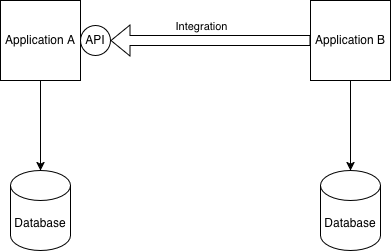
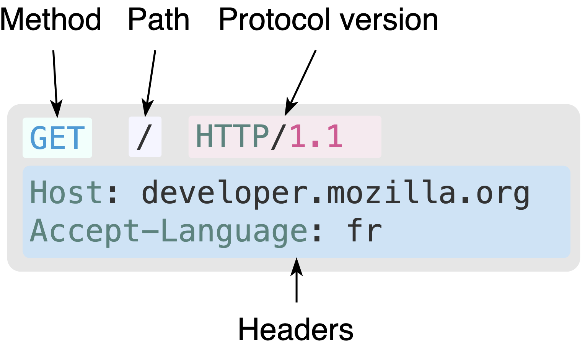
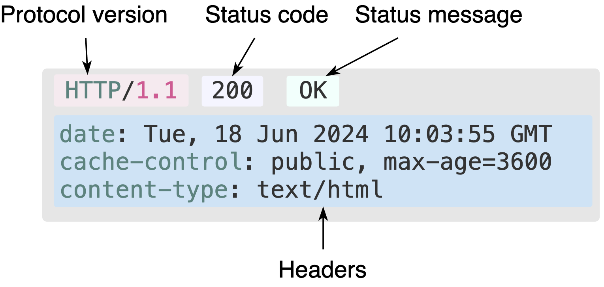

# Übersicht



---

- Applikationen halten ihre Daten in einer Datenbank
- Um Prozesse zu automatisieren, ist es nötig, dass Applikationen auf Daten von anderen Applikationen zugreifen können
- Dazu werden Programmierschnittstellen (Application Programming Interface, API) benötigt
- REST hat sich als API-Design Paradigma breit durchgesetzt
- Eine von der Datenbank unabhängige API ermöglicht es, eine stabile Schnittstelle anzubieten, die unabhängig von der
  Datenbanstruktur ist.
- Eine REST-API ermöglicht viele verschiedene
  [Integrations-Stile](https://www.enterpriseintegrationpatterns.com/patterns/messaging/IntegrationStylesIntro.html)

# Datenbanken

- **Abrufen**, **Speichern**, **Überschreiben** und **Löschen** von Daten
- Datenintegrität
- Datensicherheit / Zugriffsschutz
- Koordination von parallelen Zugriffen

https://de.wikipedia.org/wiki/Datenbank

## Datenbanksysteme

- Relational
    - MySQL / MariaDB
    - **PostgreSQL**
    - SQLite
- Dokumentorientiert
    - CouchDB
    - MongoDB

https://de.wikipedia.org/wiki/Liste_der_Datenbankmanagementsysteme

## Relationale Datenbanken

- Tabellen mit Relationen
- Schema muss vorgängig definiert werden

### Beispiel

- Leere Datei erstellen: `touch example.sqlite`

Diese Datei mit einem Datenbank Client öffnen:

- https://www.jetbrains.com/de-de/pycharm/
- https://sqlitebrowser.org/

---

#### Schema erstellen

```sqlite
CREATE TABLE items
(
    id          integer PRIMARY KEY,
    name        TEXT NOT NULL,
    description TEXT
)
```

https://www.sqlite.org/datatype3.html

#### Indexes

```sqlite
CREATE INDEX name_index
    ON items (name);
```

---

#### Datensatz hinzufügen

```sqlite
INSERT
INTO items (id, name, description)
VALUES (1, "item 1", "description 1")
```

---

#### Datensatz abrufen

```sqlite
SELECT *
FROM items
WHERE id = 1
```

# Internetprotokolle

## HTTP

### HTTP Request

```http request
GET / HTTP/1.1
Host: developer.mozilla.org
Accept-Language: de
```

`curl -i -X -H "Accept-Language: de" GET http://developer.mozilla.org`

---



---

```
HTTP/1.1 200 OK
Date: Sat, 09 Oct 2010 14:28:02 GMT
Server: Apache
Last-Modified: Tue, 01 Dec 2009 20:18:22 GMT
ETag: "51142bc1-7449-479b075b2891b"
Accept-Ranges: bytes
Content-Length: 29769
Content-Type: text/html
Cache-Control: max-age=604800

<!doctype html>… (here come the 29769 bytes of the requested web page)
```

---



https://developer.mozilla.org/en-US/docs/Web/HTTP/Guides/Overview

### Methods

| Methode | Beschreibung              |
|---------|---------------------------|
| GET     | requests a representation |
| POST    | submit an entity          |
| DELETE  |                           |
| PUT     | replace an entity         |
| PATCH   | update an entity          |

### Status Codes

| Code | Bedeutung             |
|------|-----------------------|
| 200  | Ok                    |
| 301  | Moved Permanently     |
| 400  | Bad Request           |
| 404  | Not Found             |
| 500  | Internal Server Error |

https://developer.mozilla.org/en-US/docs/Web/HTTP/Reference/Status

### Headers

https://developer.mozilla.org/en-US/docs/Web/HTTP/Reference/Headers

### cURL

- https://devhints.io/curl
- https://curl.se/docs/manpage.html

- Nur Header anzeigen `curl -IL teko.ch`
- Seiteninhalt in Datei speichern: `curl -L teko.ch -o "teko.html"`
- Verfügbarkeit einer Resource prüfen: `curl -o /dev/null --silent -Lw "%{http_code}" teko.ch`