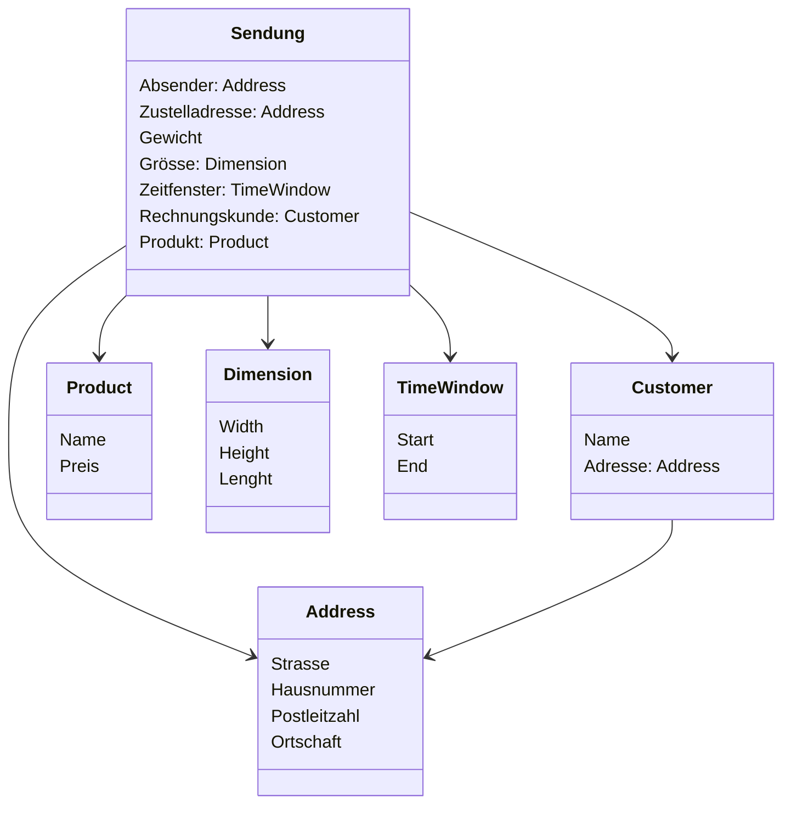

# Klassendiagramm Kuriersendung

## Lösung

```mermaid
classDiagram
    class Sendung {
        Absender: Address
        Zustelladresse: Address
        Gewicht
        Grösse: Dimension
        Zeitfenster: TimeWindow
        Rechnungskunde: Customer
        Produkt: Product
    }
    
    class Customer {
        Name
        Adresse: Address
    }
    
    class Address {
        Strasse
        Hausnummer
        Postleitzahl
        Ortschaft
    }
    
    class Product {
        Name
        Preis
    }
    
    class Dimension {
        Width
        Height
        Lenght
    }
    
    class TimeWindow {
        Start
        End
    }
            
    Sendung --> Address
    Sendung --> Dimension
    Sendung --> TimeWindow
    Sendung --> Customer
    Sendung --> Product
    
    Customer --> Address
```