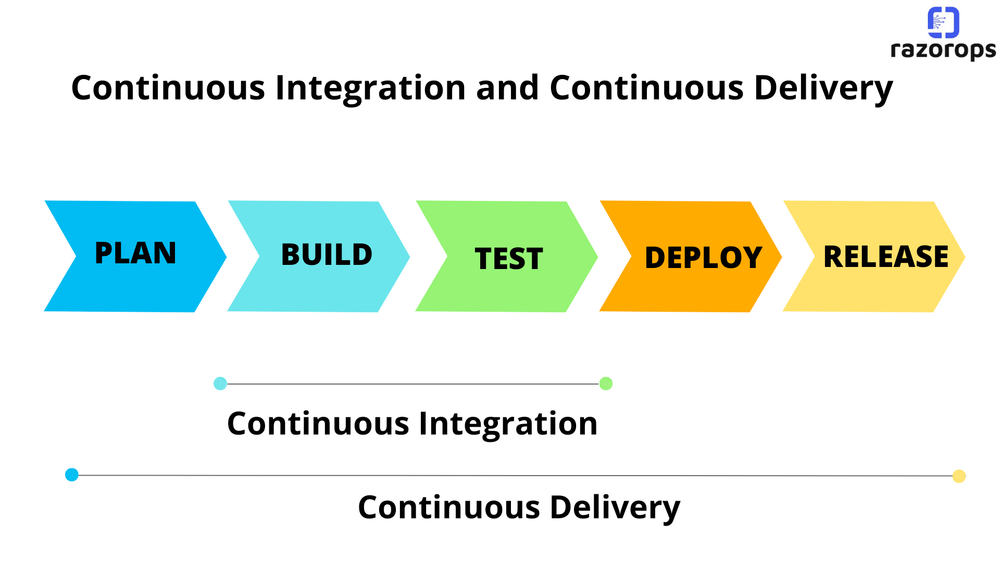

# Einstieg

> The Mind Is Not a Vessel That Needs Filling, But Wood That Needs Igniting
-- Plutarch

## Softwareentwickler:innen bauen Maschinen

- Unsere Maschinen können nicht angefasst werden: Sie sind nicht materiell
- Wir sprechen von Programmen oder Systemen (Software)
- Um eine Softwaremaschine laufen zu lassen brauchen sie eine physische Maschine: den Computer (Hardware)

## Computer

- Computer sind universelle Maschinen. Sie führen die Programme aus, die wir ihnen füttern.
- Der Computer findet das Programm im Speicher und führt es aus.
- Die einzigen Grenzen sind unsere Vorstellungskraft


## Computer

- Gute Nachricht
    - Dein Computer macht genau das, was man ihm sagt.
    - Er macht es sehr schnell.
- Schlechte Nachricht
    - Dein Computer macht genau das, was man ihm sagt.
    - Er macht es sehr schnell.

## Programme erstellen und laufen lassen


## Programme erstellen und laufen lassen


## Programme erstellen und laufen lassen


## Software sollte folgende Merkmale haben:

- **Korrekt**: Machen, was es sollte.
- **Erweiterbar**: Einfach zu ändern sein.
- **Lesbar**: durch Menschen.
- **Wiederverwertbar**: Das Rad nicht neu erfinden.
- **Robust**: Korrekt auf Fehler reagieren.
- **Sicher**: Angreifer abwehren.

## Software schreiben ist herausfordernd

- Programme können «abstürzen»
- Programme, die nicht «abstürzen» funktionieren nicht zwangsläufig richtig.
    - [Ariane5 Rakete, 1996](https://www.youtube.com/watch?v=PK_yguLapgA)
- Fehlerhafte Programme können Menschen töten (medizinische Geräte, Luftfahrt).
    - [Boeing 737 MCAS](https://www.youtube.com/watch?v=H2tuKiiznsY)
- Programmierer sind verantwortlich für das korrekte Funktionieren der Programme.
- Das Ziel dieses Fachs ist, nicht nur programmieren zu lernen, sondern gut programmieren zu lernen.

## Software schreiben macht Spass

- Entwickle deine eigene Maschine!
- Kreativität und Vorstellungsvermögen kann ausgelebt werden!
- Programme retten leben und machen die Welt besser!

# Entwicklungswerkzeuge

## Programmiersprachen


[Tiobe Index](https://www.tiobe.com/tiobe-index/)
[God-Tier Developer Roadmap](https://www.youtube.com/watch?v=pEfrdAtAmqk)

### Übersicht

| Name       | Veröffentlichung |                 | Typisierung | Paradigmen  (imperativ sind alle) |
|------------|------------------|-----------------|-------------|-----------------------------------|
| C          | 1972             | Kompiliert      | statisch    | strukturiert                      |
| C++        | 1985             | Kompiliert      | statisch    | objektorientiert                  |
| Python     | 1991             | Interpretiert   | dynamisch   | strukturiert, objektorientiert    |
| JavaScript | 1995             | Interpretiert   | dynamisch   | objektorientiert                  |
| PHP        | 1995             | Interpretiert   | dynamisch   | strukturiert, objektorientiert    |
| Java       | 1995             | Kompiliert (VM) | statisch    | objektorientiert                  |
| C#         | 2000             | Kompiliert      | statisch    | objektorientiert                  |

---

| Name | Veröffentlichung |            | Typisierung | Paradigmen                                 |
|------|------------------|------------|-------------|--------------------------------------------|
| Go   | 2012             | Kompiliert | statisch    | strukturiert, objektorientiert             |
| Rust | 2015             | Kompiliert | statisch    | strukturiert, funktional, objektorientiert |

### Anwendungsgebiete

|            | Anwendungsgebiet                                                         |
|------------|--------------------------------------------------------------------------|
| C          | Betriebssystemen und Embedded                                            |
| C++        | Betriebssystemen, Desktop Applikationen, Games, Datenbanken, Interpreter |
| Java       | Enterprise Umfeld                                                        |
| C#         | Game Entwicklung (Unity), Microsoft Ökosystem, Enterprise Umfeld         |
| Python     | Wissenschaften, Machine Learning, Big Data, Einsteiger, Automation       |
| JavaScript | Web Frontend und Backend                                                 |
| PHP        | Web                                                                      |

---

|      | Anwendungsgebiet                                                                      |
|------|---------------------------------------------------------------------------------------|
| Go   | Web Backend, Tooling, DevOps                                                          |
| Rust | Betriebssystemen, Desktop Applikationen, Games, Datenbanken, Interpreter, Web Backend |

---

### Beispielapplikationen

| Sprache | Applikation                                                           |
|---------|-----------------------------------------------------------------------|
| Go      | CockroachDB, Kubernetes, Docker, Hugo, Terraform, Prometheus, Grafana |

### Energy, Time, Memory Comparison


## Entwicklungsumgebungen


### Eclipse

- JavaScript/TypeScript, C/C++, PHP, Rust etc
- Open Source

### Microsoft Visual Studio

- VB, C, C++, C##, SQL, TypeScript, Python, HTML, JavaScript, CSS
- Closed Source

### Microsoft Visual Studio Code

- JavaScript, TypeScript, HTML, CSS, etc
- Open Source, Proprietär, frei

### JetBrains

- Java, Kotlin, Groovy, Scala, JavaScript, TypeScript, C (CLion), PHP (PHPStorm), Ruby (RubyMine), Python (PyCharm),
  iOS (AppCode), Android (AndroidStudio), C## (Rider)
- Teilweise OpenSource (Community Version)

### Jetbrains PyCharm


### Debugging


## Versionsverwaltung

- Protokollierung von Änderungen
- Wiederherstellung von alten Ständen
- Archivierung
- Koordinierung des gemeinsamen Zugriffs
- Entwicklungszweige (Branches) -> [Don’t Branch!](https://www.youtube.com/watch?v=v4Ijkq6Myfc)

### Moderne Versionsverwaltung

- [CI/CD](https://www.redhat.com/cms/managed-files/ci-cd-flow-desktop_edited_0.png)
- [GitOps](https://www.atlassian.com/git/tutorials/gitops)
- [Infrastructure as Code](https://en.wikipedia.org/wiki/Infrastructure_as_code)
- Documentation as Code
- Everything as Code

### [Git](https://git-scm.com/downloads)

- Fast jede Funktion arbeitet lokal -> Repository wird repliziert
- Optimistic Locking
- Git stellt Integrität sicher
- [Git fügt im Regelfall nur Daten hinzu](https://git-scm.com/book/de/v2/Erste-Schritte-Was-ist-Git%3F)
- Snapshots statt Unterschiede
  

### Die drei Zustände

- Modified
- Staged
- Committed
  

### Arbeiten mit Git

#### Initialisieren

- Auf Github oder Gitlab ein leeres Projekt erstellen
- [Dieses Projekt lokal klonen](https://git-scm.com/docs/git-clone) `git clone`
- User name setzen: `git config user.name <name>`

---

#### Arbeitsablauf

- [Lokales Repository aktualisieren](https://git-scm.com/docs/git-pull) `git pull origin`
- Source Dateien erstellen oder editieren
- [Änderungen zum Staging Area hinzufügen](https://git-scm.com/docs/git-add) `git add <directory>` (z.B. ".")
- [Änderungen im Repository festhalten](https://git-scm.com/docs/git-commit)
  `git commit -m "<message>"` (z.B. "change data type")
- [Lokales Repository aktualisieren](https://git-scm.com/docs/git-pull) `git pull <remote>` (z.B. "origin")
    - Mit Rebase bleibt die History aufgeräumter: `git pull --rebase`
- [Änderungen auf Github/Gitlab/Bitbucket laden](https://git-scm.com/docs/git-push) `git push <remote> <branch>` (z.B. "
  origin main")

### PyCharm Git Integration


---


### Conventional Commits

- Die Commit History (`git log`) sollte sich idealerweise wie ein Buch lesen
- [Conventional Commits](https://www.conventionalcommits.org/en/v1.0.0/) sind spezifizieren die Struktur von Commits
- Dies macht die Art der Änderung klarer
- Damit können Versionen und Changelogs automatisch erstellt werden
- Mit Tags werden Releases markiert. [semantic versioning](https://semver.org/).

```
feat: allow provided config object to extend other configs

BREAKING CHANGE: `extends` key in config file is now used for extending other config files
```

### Git Ressourcen

- [Cheatsheet](https://www.atlassian.com/git/tutorials/atlassian-git-cheatsheet)
- [Atlassian Tutorials](https://www.atlassian.com/git/tutorials/what-is-version-control)
- [Git Tutorials](https://git-scm.com/book/de/v2/Erste-Schritte-Was-ist-Git%3F)
- [Simulationstool](https://learngitbranching.js.org/)

### Plattformen: Github / Gitlab

- Git Server
- CI/CD Plattform
- Issue Tracking / Projektmanagement
- Dokumentation
- Webhosting
- Release Management

---

#### Issue Tracking


# Testing

## Kosten von Defekten


## Pair Programming


## Test Driven Development (TDD)

- Test First: Fokus auf die Problemstellung und Schnittstelle
- Nur eigenen Code testen. Datenbanken, APIs oder Libraries werden nur im Rahmen von Integrationstests aufgerufen.
- Tests geben eine Rückmeldung zum Code: Wenn Code schwierig zu testen ist, sollte er vermutlich anders strukturiert
  werden.
- [Humble Object](https://martinfowler.com/bliki/HumbleObject.html): Code, der schwierig zu testen ist in einem
  minimalen Objekt isolieren

---


---


---


---

Drei Abbildungen aus: Growing Object-Oriented Software by Nat Pryce and Steve Freeman

## Testpyramide


- Akzeptanztests stellen sicher, dass die Applikation die Kundenkriterien erfüllt.
- Unit-Tests stellen sicher, dass einzelne Programmteile wie von den Entwicklern beabsichtigt funktionieren
- Integrationstests sind optional

## Testing: AAA

- **Arrange**: Set up your data
- **Act**: Execute code under Test
- **Assert**: Verify that the result is correct

```python
# Unit Under Test
from ProgrammingBasicsAndAlgorithms.Exercises.Basics.Solutions.sort import sort
# Testing Library
import unittest


# Test suite
class TestSort(unittest.TestCase):
    # Test
    def test_sort(self):
        a = [3, 0, 12, 8]  # Arrange
        b = sort(a)  # Act
        self.assertEqual(b, [0, 3, 8, 12])  # Assert
```

## FIRST

- Fast: Tests should run quickly to encourage frequent execution.
- Isolated: Each test should run independently and not depend on other tests or external systems.
- Repeatable: Tests should produce the same results every time, regardless of the environment.
- Self-validating: Tests should have clear pass/fail outcomes without manual inspection.
- Timely: Write tests when the code is fresh, ideally before or during implementation.

## IDE Integration


## Testing: Further Reading

- [How to write clear and robust unit tests: the dos and don'ts](https://levelup.gitconnected.com/how-to-write-clear-and-robust-unit-tests-the-dos-and-donts-5021c097d041)
- [The Real Value of Testing](https://drpicox.medium.com/the-real-reason-to-do-testing-6f12b410dde3)

# Dokumentation (as Code)

- Geeignet für Versionverwaltung
- Kein Kontextwechsel für Dokumentation

## Markdown

```markdown
## Markdown

- Triviale Syntax
- Sehr zukunftssicher (plain text)
- Syntax-highlight für Code
- Automatisierbar
- Sehr hohe Verbreitung
```

### Markdown Tools

- Documents: [https://dillinger.io/](https://dillinger.io/), [Pandoc](https://pandoc.org/)
- [Github](https://docs.github.com/de/get-started/writing-on-github/getting-started-with-writing-and-formatting-on-github)
- [Gitlab](https://docs.gitlab.com/ee/user/markdown.html)
- Websites: [Hugo](https://gohugo.io/), [Eleventy](https://www.11ty.dev/)
- Notes: [Obsidian](https://obsidian.md/)
- Slides: [Marp](https://marp.app/), [Pandoc](https://pandoc.org/)
- Dokumentation: [MKDocs](https://www.mkdocs.org/)
- Books
- [etc etc etc](https://www.markdownguide.org/tools/)

### Markdown Basic Syntax


[markdownguide.org](https://www.markdownguide.org/)

### Diagramme in Markdown

-[Mermaid](https://mermaid.js.org/)

# CI / CD



https://www.razorops.com/blog/what-is-continuous-integration-and-continuous-delivery

## CI/CD mit Git

- Tests und Linter werden bei Commit automatisch ausgeführt und Commit ggf. abgelehnt.
- Das neuste Release wird automatisch deployed.

#### Gitlab CI/CD Plattform


# Algorithmen und Datenstrukturen

## Containerdatenstrukturen

- Enthalten andere Objekte («items»)
- Grundsätzliche Operationen:
    - Elemente hinzufügen
    - Elemente entfernen
    - Ein Element suchen
    - Über alle Elemente iterieren
- Verschiedene Implementationen unterscheiden sich
    - Welche Operationen möglich sind
    - Wie schnell diese sind
    - Wie der Speicher ausgenutzt wird

## Konkrete Datenstrukturen

### Array


### Graph


## Abstrakte Datenstrukturen

### Record

- Einfachste Anordnung von Daten
- Zeile in Datenbank / Tabelle
- Datenobjekte

```C
// C
struct date {
  int year;
  int month;
  int day;
}
```

```python
# python
tup1 = ('physics', 'chemistry', 1997, 2000)
```

### Set

- Anordnung von Elementen
- keine Duplikate
- keine definierte Ordnung
- testen, ob Teil des Sets

```python
# python
thisset = {"apple", "banana", "cherry"}
```

### List

- Definierte Ordnung
- Elemente hinzufügen und entfernen
- Element mit einem Index abrufen
- Duplikate möglich

```python
# python
list2 = [1, 2, 3, 4, 5, 6, 7]
first_item = list2[0]  # select first item
list2[1:5]  # select items 2 to 6
```

### Map

- Schlüssel / Wert Paare
- Hinzufügen, Entfernen, Ändern, Abrufen
- Assoziatives Array, Lookup Table, Dictionary

```python
# python
dict = {'Name': 'Zara', 'Age': 7, 'Class': 'First'}
dict['Name']  # Zara
```

### Queue

- FIFO: First In, First Out
- Warteschlange, Pipe
  

### Stack

- LIFO: Last In, First Out
- push: Neues Element speichern
- pop: Letztes Element abrufen und entfernen
- Stapelspeicher, Kellerspeicher
  

---


## Tree


---


## Komplexität von Algorithmen

### Speicher und Rechenaufwand von Datenstrukturen


### Big O Notation

 [Big O Cheatsheet](https://www.bigocheatsheet.com/)

- O(1): Operation dauert immer gleich lange, unabhängig von der Anzahl der Elemente
- O(n): Operation ist linear abhängig von der Anzahl der Elemente (Je mehr Elemente in der Liste, desto länger dauert
  die Operation)

### Alternative Big O Notation

|         |          |
|---------|----------|
| O(1)    | O(yeah)  |
| O(logn) | O(nice)  |
| O(n)    | O(k)     |
| O(n^2)  | O(my)    |
| O(2^n)  | O(no)    |
| O(n!)   | O(mg)    |
| O(n^n)  | O(sh*t!) |

https://quanticdev.com/algorithms/primitives/alternative-big-o-notation/

# Dependencies

## Herausforderungen

- Verschiedene Projekte benötigen verschiedene Versionen der gleichen Bibliothek
- Sicherheitslücken müssen erkannt und behoben werden
- Neue Funktionalität sollte geladen werden können
- Builds sollten reproduzierbar sein

## Lösung: Packetmanager

- Python: PIP
- NodeJS: NPM
- PHP: Composer
- Go: go get
- Rust: cargo
- Java: Maven

## Paketmanager

- Laden von Bibliotheken `pip install pip-audit`
- Aktualisierungen  `pip install --upgrade <package-name>`
- Dependency Checks: `pip-audit`, `npm audit`
- Dependencies werde pro Projekt festgehalten
    - Python: requirements.txt, virtual env
    - JS: package.json, node_modules
    - GO: go.mod

## Requirements.txt

```bash
pip freeze > requirements.txt  # generate
pip install - r requirements.txt  # load
```

```requirements
click == 8.1.3
ghp-import == 2.1.0
importlib-metadata == 4.11.4
Jinja2 == 3.1.2
joblib == 1.2.0
Markdown == 3.3.7
```

## Semantic Versioning

> Auf Grundlage einer Versionsnummer von MAJOR.MINOR.PATCH werden die einzelnen Elemente folgendermaßen erhöht:

> 1. MAJOR wird erhöht, wenn API-inkompatible Änderungen veröffentlicht werden,
> 2. MINOR wird erhöht, wenn neue Funktionalitäten, die kompatibel zur bisherigen API sind, veröffentlicht werden, und
> 3. PATCH wird erhöht, wenn die Änderungen ausschließlich API-kompatible Bugfixes umfassen.

> Außerdem sind Bezeichner für Vorveröffentlichungen und Build-Metadaten als Erweiterungen zum MAJOR.MINOR.
> PATCH-Format verfügbar.

https://semver.org/lang/de/

## Tipps

- Abhängigkeiten Automatisiert auf Updates und Sicherheitslücken testen
- Versionen immer "pinnen": `3.2.1`, ~~`^3.2.1`~~,  ~~`3`~~
- Vorsicht bei indirekten Abhängigkeiten!

## Container

Applikation wird mitsamt ihren Abhängigkeiten in einen "Container" gepackt.

```Dockerfile
FROM node:20

ARG ENVIRONMENT="development"

WORKDIR /usr/src/app

COPY backend /usr/src/app
RUN rm /usr/src/app/lib
COPY lib /usr/src/app/lib

RUN npm ci --verbose

EXPOSE 8080

CMD ./setup-ci.sh
```

# Clean Code

[https://cleancoders.com/](https://cleancoders.com/)
[Clean Code: A Handbook of Agile Software Craftsmanship](https://www.amazon.com/Clean-Code-Handbook-Software-Craftsmanship/dp/0132350882)

## Bezeichner

> There are only two hard things in Computer Science: cache invalidation and naming things.
> -- Phil Karlton

## Bezeichner

- Zweck erkennbar
- Keine Falschinformation
- Unterscheidbar
- Aussprechbar
- Suchbar
- Klassen: Nomen
- Methoden: Verben
- Länge dem Scope entsprechend

## Funktionen

- Kurz!
- Machen nur etwas
- Keine Nebenwirkungen
- Höchstens 3 Parameter
- Don't Repeat Yourself

## Kommentare

- Code sollte selbsterklärend sein
- Informativ
- Absicht erklären
- Erläuterung
- Warnung
- Todo

# Refactoring

## Why Should You Refactor?

* Refactoring Improves the Design of Software
* Refactoring Makes Software Easier to Understand
* Refactoring Helps You Find Bugs
* Refactoring Helps You Program Faster

## When Should You Refactor?

* [The Rule of Three](https://en.wikipedia.org/wiki/Rule_of_three_(computer_programming))
* Refactor When You Add Functionality
* Refactor When You Need to Fix a Bug
* Refactor As You Do a Code Review

# Fehlerbehandlung

- Exceptions, die im normalen Programmablauf auftreten können (z.B. Fehlerhafter User Input, Netzwerkverbindung offline)
  müssen gefangen und behandelt werden.
- Exceptions aufgrund von einem Programmierfehler sollten nicht gefangen werden.
- Code für die Fehlerbehandlung sollte möglichst vom Code der Funktionalität getrennt werden.

## Geworfene Exceptions

```python
try:
    foo()  ## method that might raise an exception
except:
## handle exception
```

```python
raise Exception('<error message>')
```

## Fehler als Rückgabewert

- Exceptions können es schwierig machen, den Programmablauf nachzuvollziehen, weil Exceptions den normalen
  Programmablauf unterbrechen.
- In Go müssen Fehler als Rückgabewert explizit angegeben werden.
- Die kann mit Fehlertypen auch in den meisten anderen Sprachen erreicht werden

```go
swagger, err := api.GetSwagger()
if err != nil {
fmt.Fprintf(os.Stderr, "Error loading swagger spec\n: %s", err)
os.Exit(1)
}
```

```go
func Sqrt(f float64) (float64, error) {
if f < 0 {
return 0, errors.New("math: square root of negative number")
}
// implementation
}
```

### Fehler als Rückgabewert in Python

```python
def return_value():
    return 'foo', None


def test_return_value(self):
    value, error = return_value()
    self.assertIsNotNone(value)
    self.assertIsNone(error)


def return_error():
    return None, Exception('something went wrong')


def test_return_error(self):
    value, error = return_error()
    self.assertIsNotNone(error)
    self.assertIsNone(value)
```

# Programmierelemente

Alle folgenden Folien aus: https://go.dev/ref/spec

## Lexical Elements

### Kommentare

```go
// single line comment

/*
multi
line
comment
*/
```

### Keywords

```
break        default      func         interface    select
case         defer        go           map          struct
chan         else         goto         package      switch
const        fallthrough  if           range        type
continue     for          import       return       var
```

### Operators and Punctuation

```
+    &     +=    &=     &&    ==    !=    (    )
-    |     -=    |=     ||    <     <=    [    ]
*    ^     *=    ^=     <-    >     >=    {    }
/    <<    /=    <<=    ++    =     :=    ,    ;
%    >>    %=    >>=    --    !     ...   .    :
     &^          &^=          ~
```

### Identifiers

- Identifiers name program entities such as variables and types.
- An identifier is a sequence of one or more letters and digits.
- The first character in an identifier must be a letter.

---

#### Predefined Identifiers

```
Types:
	any bool byte comparable
	complex64 complex128 error float32 float64
	int int8 int16 int32 int64 rune string
	uint uint8 uint16 uint32 uint64 uintptr

Constants:
	true false iota

Zero value:
	nil

Functions:
	append cap clear close complex copy delete imag len
	make max min new panic print println real recover
```

### Literals

```go
// Integer
42
0x_67_7a_2f_cc_40_c6
170_141183_460469_231731_687303_715884_105727
0b0101010101

// Floating Point
0.
72.40
2.71828
6.67428e-11
1E6

// String
"Hello, world!"
```

## Variables

- A variable is a storage location for holding a value. 
- The set of permissible values is determined by the variable's type.

## Types

- A type determines a set of values together with operations and methods specific to those values.
- A type may be denoted by a type name [...].

### Numeric Types
```go
uint8       the set of all unsigned  8-bit integers (0 to 255)
uint16      the set of all unsigned 16-bit integers (0 to 65535)
uint32      the set of all unsigned 32-bit integers (0 to 4294967295)
uint64      the set of all unsigned 64-bit integers (0 to 18446744073709551615)

int8        the set of all signed  8-bit integers (-128 to 127)
int16       the set of all signed 16-bit integers (-32768 to 32767)
int32       the set of all signed 32-bit integers (-2147483648 to 2147483647)
int64       the set of all signed 64-bit integers (-9223372036854775808 to 9223372036854775807)

float32     the set of all IEEE 754 32-bit floating-point numbers
float64     the set of all IEEE 754 64-bit floating-point numbers

complex64   the set of all complex numbers with float32 real and imaginary parts
complex128  the set of all complex numbers with float64 real and imaginary parts

byte        alias for uint8
rune        alias for int32

uint     either 32 or 64 bits
int      same size as uint
```

### Array Types
```go
[32]byte
[3][5]int
[2][2][2]float64  // same as [2]([2]([2]float64))
```

### Struct Types
```go
struct {
	x, y int
	u float32
	_ float32  // padding
	A *[]int
	F func()
}
```

## Blocks

- A block is a possibly empty sequence of declarations and statements within matching brace brackets.
- Blocks nest and influence scoping.

## Declarations

- A declaration binds a non-blank identifier to a constant, [...] variable, function, [...].
- Every identifier in a program must be declared.
- No identifier may be declared twice in the same block, [...].

```go
// constant
const Pi float64 = 3.14159265358979323846

// variable
var x int
var i = 42

// function
func IndexRune(s string, r rune) int {
	// implementation
    return
}
```
### Scope

The scope of a declared identifier is the extent of source text in which the identifier denotes the specified constant, type, variable, function, label, or package.

Go is lexically scoped using blocks:

1. The scope of a predeclared identifier is the universe block.
2. The scope of an identifier denoting a constant, type, variable, or function [...] declared at top level (outside any function) is the package block.
3. The scope of an identifier denoting a [...] function parameter, or result variable is the function body.
4. The scope of a constant or variable identifier declared inside a function begins at the end of the ConstSpec or VarSpec [...] and ends at the end of the innermost containing block.

(for full list see: https://go.dev/ref/spec#Declarations_and_scope)

## Expressions

An expression specifies the computation of a value by applying operators and functions to operands.

```go
2 + 3
square(5)
```

## Statements

Statements control execution.

### Assignment

An assignment replaces the current value stored in a variable with a new value specified by an expression.

```go
x = 1
*p = f()
a[i] = 23
```

### If Statements

- "If" statements specify the conditional execution of two branches according to the value of a boolean expression.
- If the expression evaluates to true, the "if" branch is executed, otherwise, if present, the "else" branch is executed.

```go
if x > max {
	x = max
} else {
	x = 3
}
```

### Switch Statements

- "Switch" statements provide multi-way execution.
- An expression or type is compared to the "cases" inside the "switch" to determine which branch to execute.

```go
switch {
  case x < y: 
	  f1()
  case x < z: 
	  f2()
  case x == 4: 
	  f3()
}
```

### For Statements

A "for" statement specifies repeated execution of a block.

```go
for a < b {
    a *= 2
}

for i := 0; i < 10; i++ {
    f(i)
}
```

### Return statements

A "return" statement in a function F terminates the execution of F, and optionally provides one or more result values.

```go
func noResult() {
    return
}
```

