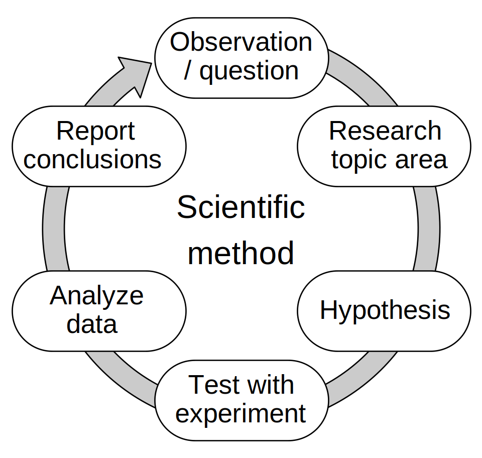

# Empiricism

1. **Beobachtung** festhalten und **Fragestellung** formulieren
2. **Recherche**
3. **Hypothese** formulieren
4. **Testen** der Hypothese mit **Experimenten**
5. **Experimente auswerten**
6. **Schlussfolgerungen** und Ausblick formulieren

(vgl. https://en.wikipedia.org/wiki/Scientific_method)

Der Ablauf kann beliebig oft wiederholt werden. 
Entsprechend klein kann der Fokus der Fragestellung sein.