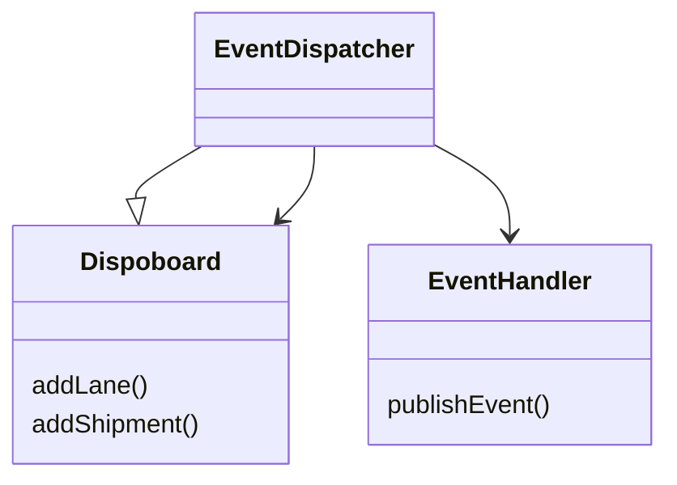

# GRASP: Patterns of General Principles in Assigning Responsibilities

## Low Coupling

### Name des Patterns 
Low Coupling - Niedrige Kopplung

<i> Kopplung ist ein Mass dafür, wie stark ein Element mit anderen Elementen 
verbunden ist, davon Kenntnis hat oder sich auf dies verlässt.</i>

### Problem, dass das Pattern löst:
Wie kann man eine geringe Abhängigkeit, geringe Auswirkungen von Änderungen 
und eine erhöhte Wiederverwendung unterstützen?

Eine Klasse mit hoher Kopplung ist auf viele andere Klassen angewiesen. 
Solche Klassen können unerwünscht sein und leiden unter folgenden Problemen:
1. Änderungen in verwandten Klassen erzwingen lokale Änderungen.
2. Schwieriger isoliert zu verstehen.
3. Schwieriger wiederzuverwenden, da die Verwendung das zusätzliche Vorhandensein der 
Klassen erfordert, von denen es abhängig ist.

Low Coupling vorteile:
1. nicht von Änderungen an anderen Komponenten betroffen
2. isoliert einfach zu verstehen
3. einfacher wiederzuverwenden
4. Gestaltung von Klassen, die unabhängiger sind,

<i> Das Problem ist nicht die hohe Kopplung per se.  
Das Problem ist eine hohe Kopplung an Elemente, die instabil sind.</i>

Wenn Low Coupling übertrieben wird, führt dies zu einem schlechten Design,
da es zu einigen zusammenhangslosen, aufgeblähten und komplexen Objekten führt,
die die ganze Arbeit erledigen, mit vielen sehr passiven nullgekoppelten Objekten,
die als einfache Datenspeicher dienen.

### Eigenes Beispiel 
Hotelbuchung:
- Buchung
- Zimmerverwaltung
- Aufenthalt

1. Buchung > erstellt einen Aufenthalt > Zimmer reservierung in der Zimmerverwaltung 
Buchung kennt Aufenthalt und Zimmerverwaltung.
2. Buchung > an Zimmerverwaltung übergeben > welche ein Aufenthalt erstellt. 
Buchung kennt nur die Zimmerverwaltung und diese den Aufenthalt.

Variante zwei hat eine tiefere Kopplung.

### Kontext zu anderen Patterns (Grasp oder SOLID) 

<i>Manchmal schlagen verschiedene Patterns sich wiedersprechende Lösungen für das 
gleiche Problem vor.</i>

## Factory

Erzeuger-Prinzip

Das Factory-Pattern ist ein Entwurfsmuster das sich auf die Erstellung von Objekten konzentriert. 
Es gehört zur Kategorie der Erzeugungsmuster (engl. "Creational Patterns").

### Problem das das Pattern löst 

Das Factory-Pattern definiert eine Schnittstelle für die Erstellung von Objekten, aber gibt den konkreten Klassen, die tatsächlich die Objekte erstellen, die Entscheidungsfreiheit über die Art und Weise, wie die Objekte erstellt werden. 
Es ermöglicht somit eine Flexibilität in der Erstellung von Objekten, ohne die Schnittstelle für die Erstellung der Objekte zu verändern.

Das Factory-Pattern wird oft verwendet, um die Erstellung von Objekten zu abstrahieren und die Komplexität in großen Systemen zu reduzieren. 
Es ermöglicht auch eine bessere Wartbarkeit, da Änderungen an der Art und Weise, wie Objekte erstellt werden, nur in einer Klasse vorgenommen werden müssen, anstatt in vielen verschiedenen Klassen.

### Eigenes Beispiel

Um das Factory-Pattern anzuwenden würde man zum Beispiel eine Klasse VehicleFactory erstellen.
In dieser Klasse ist eine Methode createVehicle() definiert, welche ein Objekt vom Typ Vehicle zurückgibt. 
Die Methode entscheidet, welches spezifische Fahrzeugobjekt erstellt werden soll und erzeugt Objekte von konkreten Klassen wie Beispielsweise Car, Truck oder Motorcycle.

Das Factory-Pattern stellt sozusagen den Grundbauplan für die Fahrzeuge zur Verfügung.

### Kontext zu anderen Patterns (Grasp oder SOLID) 
- Geringe Kopplung wird unterstützt, was geringere Wartungsabhängigkeiten und bessere Möglichkeiten der Wiederverwendung
  mit sich bringt.

- Factory-Pattern kann auch in Verbindung mit dem Polymorphismus-Pattern verwendet werden. Das Polymorphismus-Pattern 
  schlägt vor, dass Klassen in der Lage sein sollten, unterschiedliche Formen anzunehmen und sich auf unterschiedliche 
  Weise zu verhalten.

- Das Single Responsibility Prinzip besagt, dass eine Klasse nur eine einzige Verantwortung haben sollte. 
  Das Factory-Pattern unterstützt dieses Prinzip, indem es die Erstellung von Objekten aus anderen Klassen auslagert und
  so sicherstellt, dass jede Klasse nur für eine einzige Aufgabe verantwortlich ist. 

- Das Open/Closed Prinzip besagt, dass eine Klasse offen für Erweiterungen, aber geschlossen für Modifikationen sein sollte. 
  Das Factory-Pattern unterstützt dieses Prinzip, indem es eine abstrakte Klasse oder Schnittstelle bereitstellt, 
  über die neue Objekte erstellt werden können, ohne dass die bestehenden Klassen geändert werden müssen.

## High Cohesion
### Problem
Wie behalten wir bei hoher Komplexität den Überblick?

### Lösung
Zuständigkeiten so an Klassen zuweisen, damit die Kohäsion hoch bleibt.

Hohe Kohäsion ist anstrebenswert weil so die Klassen überschaubar bleiben, die einzelnen Klassen sind einfacher zu verstehen. 
Änderungen und Erweiterungen sind einfacher, einfacher, spezialisierter Code kann einfacher wiederverwendet werden.
Klasssen und Module mit hoher Kohäsion und looser Kopplung ermöglichen ein modulares Design, da einzelne Teile einfach ausgetauscht werden können.

### Beispiel
Ein Dispoboard wird genutzt um Aufträge an Velokurier:innen zu verteilen. Bei jeder Änderung (z.B. wenn ein Auftrag als erledigt markiert wird) wird diese Änderung mit einem Event dem Backend mitgeteilt.
Naheliegend ist, den Event in der Klasse `Dispoboard` zu versenden. Das Verwalten der Aufträge und das Versenden der Events sind jedoch zwei Zuständigkeiten, die nur lose gekoppelt sind, das Dispoboard muss vom Versenden der Events gar nichts wissen da es für dessen Aufgabe nicht relevant ist, dass diese im Backend noch weiterverarbeitet werden.
Die Funktionalität wird in drei Klassen aufgeteilt:
- `Dispoboard` verwaltet die Aufträge
- `EventDispatcher` ist dafür zuständig anhand von einem Methodenaufruf den korrekten Event zu generieren.
- `EventHandler` ist dafür zuständig, den Event dem Backend zuzustellen.

Dadurch wird die Applikation deutlich modularer. Ohne grosse Anpassungen kann der `EventDispatcher` auch für andere Klassen Events generieren.
Der EventHandler kann beliebige Events auch von anderen Quellen verschicken. Zudem können einfach andere Backends angebunden werden indem ein anderer `EventHandler` genutzt wird.

### Kontext
Hohe Kohäsion geht Hand in Hand mit loser Kopplung. Werden Dinge, die zusammengehören, gruppiert (hohe Kohäsion), können Dinge, die nicht zusammengehören entkoppelt werden.

## Controller

Das Controller-Pattern ist ein Entwurfsmuster, das zur Strukturierung von Softwareanwendungen eingesetzt wird. Es gehört zum GRASP (General Responsibility Assignment Software Patterns) und hat die Verantwortung, die Interaktion zwischen Benutzerschnittstellen und anderen Komponenten einer Anwendung zu steuern.

Das Controller-Pattern hat die folgenden Verantwortlichkeiten:
- Die Aufgabe des Controllers besteht darin, Benutzeranfragen entgegenzunehmen und diese an andere Komponenten weiterzuleiten. Der Controller interpretiert die Benutzeranfrage und leitet sie an die entsprechenden Komponenten weiter.
- Der Controller ist auch dafür verantwortlich, die Antworten von Komponenten zu empfangen und an die Benutzerschnittstelle zurückzusenden. Er koordiniert also die Aktionen von verschiedenen Komponenten und sorgt dafür, dass die Benutzeranforderungen erfüllt werden.
- Der Controller ist ausserdem dafür verantwortlich, den Zustand der Anwendung zu verwalten. Er speichert Daten, die für die Verarbeitung von Benutzeranforderungen benötigt werden, und koordiniert die Aktualisierung dieser Daten.
- Durch bessere Trennung der Verantwortlichkeit werden Codeteile auch wiederverwendbar

Insgesamt hat das Controller-Pattern die Verantwortung, die Interaktion zwischen Benutzerschnittstellen und anderen Komponenten einer Anwendung zu koordinieren und sicherzustellen, dass Benutzeranforderungen effektiv und effizient verarbeitet werden. Es hilft bei der Trennung von Benutzerschnittstellen und Geschäftslogik und fördert somit eine saubere Trennung der Verantwortlichkeiten in der Anwendung.

### Eigenes Beispiel
Bei dem in der Projektarbeit verwendeten MVC Pattern, wird ebenfalls ein Controller eingesetzt. Dabei attached sich der Controller an die Gui Klasse und ans Board. Wenn nun auf dem GUi ein Knopf gedrückt wird, wird der Controller darüber informiert. Danach leitet er den Input weiter an die Board Klasse. Dort wird der Input verarbeitet. Falls die Darstellung sich ändert, wird der Controller darüber benachrichtigt. Er gibt die Aktualisierungen dann an die GUI weiter. 

### Vergleich mit anderen Mustern
- Das Controller Pattern behandelt ähnliche Themen, wie das OPEN/CLOSED Prinzip. Es geht hier darum, die graphische Benutzeroberfläche möglichst vom Modell (Businesslogik) zu trennen. So kann zum Beispiel ein GUI neu erstellt / überarbeitet werden, ohne dass das Modell geändert werden muss.
- Auch das Prinzip "Low Coupling" wird mit dem Controller Pattern beabsichtigt.