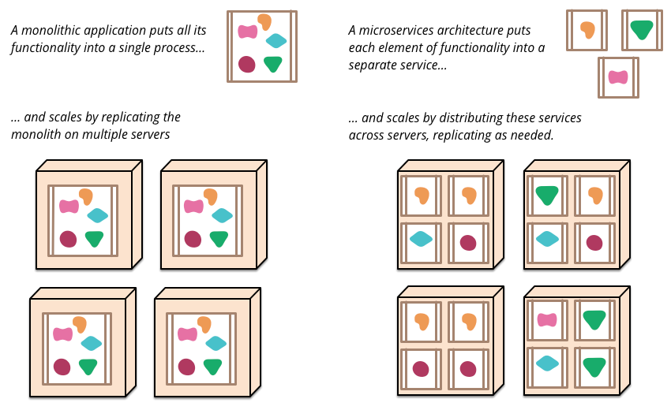

## UML Klassendiagramm


[PlantUML](https://www.plantuml.com/)

## UML Klassendiagramm


## PlantUML

```
@startuml
class Konto {
    bezeichnung
    saldo()
    einzahlen(betrag)
}

class Kunde {
}

class Privatkunde {
    vorname
    nachname
}

class Geschäftskunde {
    firmenname
}

class Adresse {
}

Kunde <|-- Privatkunde
Kunde <|-- Geschäftskunde

Privatkunde "0..*" -- "1" Adresse
Geschäftskunde "0..*" -- "1" Adresse

Konto "1..*" -- "1..*" Kunde
@enduml
```

# C4 Model

https://c4model.com/

----


----


# Moderne Softwareentwicklung

## Software Engineering

 

## Kundenorientierung

**Software soll den Kunden Mehrwert bringen**

- Software soll stabil laufen
- Neue Features sollten schnell umgesetzt und nutzbar sein
- Softwaresysteme werden immer komplexer

## Teamarbeit

- Mehrere Personen arbeiten am selben Softwareprojekt
- Versionsverwaltung wird verwendet (Git, SVN)
- Konflikte entstehen und sind aufwendig

## "Soft"-Ware

- Softwareentwicklung ist meistens Kreativarbeit
- Die Herausforderung der "Produktion" existiert kaum

## Lösungen

- Kleine Arbeitspakete iterativ und inkrementell
- Kurzer Feedbackloop
- Komplexität reduzieren
- Hohe Qualität

## Alles hängt zusammen

- Hohe Qualität reduziert Komplexität
- Hohe Qualität kürzt den Feedbackloop durch schnelle Entwicklung
- Kleine Arbeitspakete kürzen den Feedbackloop
- Kleine Arbeitspakete reduzieren Komplexität
- ...

## Manifesto for Agile Software Development

* Individuals and interactions over processes and tools
* Working software over comprehensive documentation
* Customer collaboration over contract negotiation
* Responding to change over following a plan

https://agilemanifesto.org/ (2001)

## Extreme Programming


## Embrace Change


## Iteratives und inkrementelles Arbeiten


## Iterationen


## Kurzer Feedbackloop: CI/CD


## Continuous Integration

- Kein Branching, alle Änderungen werden von allen Teammitgliedern mehrmals täglich in den Master Branch eingecheckt.
- Dieser Branch ist jederzeit lauffähig
- Dadurch werden die Releases vereinfachen
- Eine sehr hohe, automatische Testabdeckung ist zwingend

## Continuous Delivery

- Ziel: Releases werden vereinfacht
- Time to market ist kürzer, neue Features sind sofort verfügbar
- Durch automatisierte deployments ist der Aufwand initial höher, anschliessend jedoch sehr klein
- Higher quality
- Lower costs
- Better products
- Happier teams

## Principles

- Build quality in
- Work in small batches
- Computers perform repetitive tasks, people solve problems
- Relentlessly pursue continuous improvement
- Everyone is responsible

https://www.continuousdelivery.com/

[Modern Software Engineering](https://www.amazon.com/Modern-Software-Engineering-Discipline-Development/dp/0137314914)


# Testing

## Kosten von Defekten


## Pair Programming


## Test Driven Development (TDD)

- Test First: Fokus auf die Problemstellung und Schnittstelle
- Nur eigenen Code testen. Datenbanken, APIs oder Libraries werden nur im Rahmen von Integrationstests aufgerufen.
- Tests geben eine Rückmeldung zum Code: Wenn Code schwierig zu testen ist, sollte er vermutlich anders strukturiert
  werden.
- [Humble Object](https://martinfowler.com/bliki/HumbleObject.html): Code, der schwierig zu testen ist in einem
  minimalen Objekt isolieren

---


---


---


---

Drei Abbildungen aus: Growing Object-Oriented Software by Nat Pryce and Steve Freeman

### Testpyramide


### Testing: AAA

- Arrange: Set up your data
- Act: Execute code under Test
- Assert: Verify that the result ist correct

### IDE Integration


### Testing: Further Reading

- [How to write clear and robust unit tests: the dos and don'ts](https://levelup.gitconnected.com/how-to-write-clear-and-robust-unit-tests-the-dos-and-donts-5021c097d041)
- [The Real Value of Testing](https://drpicox.medium.com/the-real-reason-to-do-testing-6f12b410dde3)

## Why Should You Refactor?

* Refactoring Improves the Design of Software
* Refactoring Makes Software Easier to Understand
* Refactoring Helps You Find Bugs
* Refactoring Helps You Program Faster

## When Should You Refactor?

* [The Rule of Three](https://en.wikipedia.org/wiki/Rule_of_three_(computer_programming))
* Refactor When You Add Functionality
* Refactor When You Need to Fix a Bug
* Refactor As You Do a Code Review

# Deployment

## Deployment Pipelines


(Jez Humble, David Farley (2010): Continuous Delivery)

---


(Jez Humble, David Farley (2010): Continuous Delivery)

---


### Weitere Informationen

- [Youtube: Continous Delivery - Deployment Pipelines](https://www.youtube.com/watch?v=x9l6yw1PFbs&list=PLwLLcwQlnXBzhxIXSbtDPX78zYTgvST0B)
- Jez Humble, David Farley (2010): Continuous Delivery: Reliable Software Releases through Build, Test, and Deployment Automation, Addison-Wesley Signature Series (Fowler)


# SOLID Principles

## Single Responsibility Principle

- "A module should be responsible to one, and only one, actor." The term actor refers to a group (consisting of one or
  more stakeholders or users) that requires a change in the module.
- "A class should have only one reason to change"
  [wikipedia](https://en.wikipedia.org/wiki/Single-responsibility_principle)

## Open Closed Principle

"Software entities (classes, modules, functions, etc.) should be open for extension, but closed for modification."
[wikipedia](https://en.wikipedia.org/wiki/Open%E2%80%93closed_principle)

## Liskov's Substitution Principle

## Interface Segregation Principle

## Dependency Inversion Principle

# Dependency Inversion


# Design Patterns

Gang of Four:
Erich Gamma, Richard Helm, Ralph Johnson, John Vlissides (1995): Design Patterns, Elements of Reusable Object-Oriented
Software, Addison-Wesley

Fowler, Martin (2002): Patterns of Enterprise Application Architecture, Addison-Wesley

Hohpe, Gregor; Woolf, Bobby (2003): Enterprise Integration Patterns: Designing, Building, and Deploying Messaging
Solutions, Addison-Wesley

## Observer

 

# Architekturen


## High Cohesion - Low Coupling


## Schichtenarchitektur


## Ports and Adapters


[growing-object-oriented-software.com](https://www.martinfowler.com/microservices/)

## Traditional Monolithic Design


## Schichtenarchitektur im Client Server Modell


## Microservices


[martinfowler.com/articles/microservices.html](https://www.martinfowler.com/articles/microservices.html)

## Microservices

- Maximale Skalierbarkeit
- Einzelne Services können von **kleinen[^1]** Teams **unabhängig entwickelt und deployed** werden
- Bessere Wart- und Erweiterbarkeit
- Unterschiedliche Technologien können eingesetzt werden
- Kommunikation nicht trivial
- Höhere Wahrscheinlichkeit eines Ausfalls
- **Hohe Komplexität**

[^1]: ["We try to create teams that are no larger than can be fed by two pizzas"](https://docs.aws.amazon.com/whitepapers/latest/introduction-devops-aws/two-pizza-teams.html)

### Monolith First

- Vorsicht vor [Cargo-Kult](https://de.wikipedia.org/wiki/Cargo-Kult): Amazon, Google, Meta etc. haben heute andere
  Herausforderungen als Startups
- Technologien oder Architekturen wählen, "weil Google macht das auch so" ist ein schlechter Grund
  
  [martinfowler.com/bliki/MonolithFirst.html](https://www.martinfowler.com/bliki/MonolithFirst.html)
