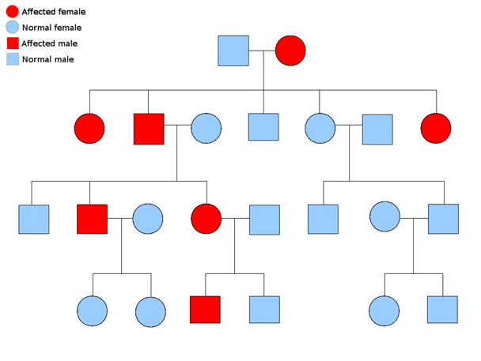
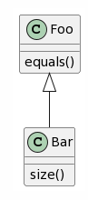

# Objektorientierte Programmierung

  1. Everything is an object, 
  2. Objects communicate by sending and receiving messages (in terms of objects),
  3. Objects have their own memory (in terms of objects), 
  4. Every object is an instance of a class (which must be an object), 
  5. The class holds the shared behavior for its instances (in the form of objects in a program list), 
  6. To eval a program list, control is passed to the first object and the remainder is treated as its message

---

  1. Alles ist ein Objekt, 
  2. Objekte kommunizieren durch das Senden und Empfangen von Nachrichten (welche aus Objekten bestehen), 
  3. Objekte haben ihren eigenen Speicher (strukturiert als Objekte), 
  4. Jedes Objekt ist die Instanz einer Klasse (welche ein Objekt sein muss), 
  5. Die Klasse beinhaltet das Verhalten aller ihrer Instanzen (in der Form von Objekten in einer Programmliste), 
  6. Um eine Programmliste auszuführen, wird die Ausführungskontrolle dem ersten Objekt gegeben und das Verbleibende als dessen Nachricht behandelt

– Alan Kay: The Early History of Smalltalk (1993)

## Eine Klasse: eine Software Maschine

<!-- bild? -->

## Was ist ein Objekt?

Es gibt verschiedene Arten von Objekten:

- “physische Objekte”: bilden physische Objekte ab, z.B. eine Ampel oder ein Auto
- “abstrakte Objekte”: Beschreiben abstrakte Dinge aus der modelierten Welt, z.B. eine Route oder eine Himmelsrichtung
- “Softwareobjekte”: Reine Softwareelemente, z.B.“Datenstrukturen wie Arrays oder Listen
- Ein grosser Vorteil der objektorientierten Programmierung ist, dass die Software anhand der «echten» Welt modeliert
  werden kann.

## Was ist ein Objekt?

- Ein Objekt besitzt Daten → Eigenschaften / Felder
- Ein Objekt kann Operationen ausführen → Funktionen / Methoden

Ein Objekt kann Operationen ausführen und dazu auf seine Daten zugreifen und diese ändern.

## Methoden

- Entspricht dem Begriff "Funktion" der strukturierten Programmierung
- Eine Operation, die von Objekten ausgeführt werden kann.
- Abfragen, Befehle
- Name der Methode kann, mit Einschränkungen, frei gewählt werden.
- Eine Methode von einem Objekt wird in den meisten Sprachen mit dem `.` aufgerufen: `<objekt>.<methode>

## Methoden

- Methoden können Argumente haben:
    - primaryStage.setTitle("Ampelsteuerung");
- Mehrere Argumente werde durch Komma getrennt:
    - primaryStage.add(crossroadController, 1100, 900);
- Weniger Argumente sind übersichtlicher! (Faustregel: Max. 3)

## Ein Objekt hat eine Schnittstelle (Interface)


## Ein Objekt hat eine Implementierung


# Abstraktion

- Ein Objekt kann verwendet werden, ohne die Implementierung der Methoden zu kennen.
- Die Implementierungsdetails sind abstrahiert

## Kapselung

- Grundsätzlich sind alle Felder (Daten) privat, d.h. nur für das eigene Objekt zugänglich.
- Diese Felder stellen den Zustand (State) des Objekts dar.
- Zugriff auf Felder wird mit Methoden gewährt (sogenannte Setter und Getter, z.B. setColor(), getSize()
- Es werden nur die nötigen Methoden zugänglich gemacht.
- Die Programmiersprache stellt den Zugriffsschutz sicher.

## Objektorientierung: Geschichte

- Untergruppe der imperativen Programmierung (Abfolge von Befehlen)
- Ursprung: Simula67, Oslo, 60er Jahre
- Kaum verbreitet in den 70er Jahren
- Smalltalk (Xerox PARC, 1970s) machte OOP Populärer

---

- Grosser Verbreitung in den 90er Jahren
- Die meisten heute verbreiteten Sprachen sind objektorientiert: Objective C, C++, Java, C#, Python, Kotlin, Go,
  JavaScript, uvm
- Heute das meistverbreitete Konzept der Softwareentwicklung
- Andere Programmierparadigmen:
    - Imperative Programmierung
        - Strukturierte Programmierung
        - Prozedurale Programmierung
    - Deklarative Programmierung
        - funktionale Programmierung

## Syntaktische Struktur einer Klasse

```
class Vehicle:                                 # Class Name
    def __init__(self, brand, model, type):    # Constructor
        self.brand = brand
        self.model = model
        self.type = type
        self.gas_tank_size = 14
        self.fuel_level = 0

    def fuel_up(self):                          # Method declaration
        self.fuel_level = self.gas_tank_size    # Method implementation
        print('Gas tank is now full.')

    def drive(self):
        print(f'The {self.model} is now driving.')

```

## Klasse

- Jedes Objekt gehört zu einer Klasse, welche die zur Verfügung stehenden Methoden und Felder definiert.
- Eine Klasse ist eine Beschreibung von Laufzeit-Objekten, welche dieselben Eigenschaften und Methoden besitzen.
- Eine Klasse ist eine Kategorie von Dingen
- Ein Objekt ist eines von diesen Dingen

## Objekte

Wenn ein Objekt O ein Objekt der Klasse C ist:

- O ist ein Exemplar von C
- O ist eine Instanz von C
  

## Objekte und Klassen

- Klassen existieren nur im Source Code
    - Bauplan für konkrete Objekte
- Objekte existieren nur zur Laufzeit

---

- Ein zentraler Aspekt der Softwareentwicklung ist das Bilden von sinnvollen Klassen für die Aufgabenstellung (
  Softwarearchitektur, OOD)
- Das Schreiben der Details wird Implementierung genannt.

## Interface (de: Schnittstelle)

- Die Schnittstelle (engl. interface) ist der Teil eines Systems, welcher der Kommunikation dient.
- Der Begriff stammt ursprünglich aus der Naturwissenschaft [...]. Er beschreibt bildhaft die Eigenschaft eines Systems
  als Black Box, von der nur die „Oberfläche“ sichtbar ist, und daher auch nur darüber eine Kommunikation möglich
  ist. [...]
- Daneben bedeutet das Wort „Zwischenschicht“: Für die beiden beteiligten Boxes ist es ohne Belang, wie die jeweils
  andere intern mit den Botschaften umgeht, und wie die Antworten darauf zustande kommen.


## Interfaces

- User interface: Wenn die Clients Menschen sind
    - GUI: Graphical User Interface
    - Text interfaces, command line interfaces.
- Program interface: Wenn die Clients Software sind
    - API: Application Program Interface

## API

- Eine Schnittstelle gibt an, welche Methoden vorhanden sind oder vorhanden sein müssen.
- Zusätzlich zu dieser syntaktischen Definition sollten Vorbedingungen und Nachbedingungen der verschiedenen Methoden
  definiert werden.
- Heute werden dazu in der Regel automatisierte Tests geschrieben.
- Es kann auch in der Dokumentation festgehalten werden.

## Schnittstellen definieren

- Nicht jede Methode ist für jeden möglichen Parameter geeignet
- Lösungen:
    - immer: gute Wahl der Bezeichner
    - möglichst immer: Tests
    - Einschränkung durch Datentyp
    - wenn nötig: Kommentare: JavaDoc
    - falls erforderlich: Exceptions

## Javadoc


# Objektorientierte Prinzipien

> I thought of objects being like biological cells and/or individual computers on a network, only able to communicate
> with messages (so messaging came at the very beginning – it took a while to see how to do messaging in a programming
> language efficiently enough to be useful).

> OOP to me means only messaging, local retention and protection and hiding of state-process, and extreme late-binding
> of all things.

beide Alan Kay, http://userpage.fu-berlin.de/~ram/pub/pub_jf47ht81Ht/doc_kay_oop_en

## Vererbung



## Vererbung

- Generalisierung / Spezialisierung
- Polymorphismus
- Dynamisches Binden

## Vererbung

Eine Klasse ist ein Modul:

- Eine Sammlung von Funktionalität (Methoden)
- Kapselung (nicht alle Funktionalität ist sichtbar)

Eine Klasse ist ein Datentyp:

- Beschreibt die Art einer Objektinstanz
- Kann bei Variablen, Methoden oder Feldern verwendet werden

## Vererbung

- Eine neue Klasse kann als Erweiterung oder Spezialisierung einer existierenden Klasse beschrieben werden.
- `Bar` erbt von `Foo`
    - Modul: Alle Funktionalität von `Foo` steht in `Bar` zur Verfügung
    - Typ: Immer wenn eine Instanz von `Foo` benötigt wird, wird eine Instanz von `Bar` akzeptiert
- Oder umgekehrt: Eine neue Klasse kann eine existierende Klasse generalisieren

## Vererbung



```
@startuml
Foo : equals()
Bar : size()

Foo <|-- Bar
@enduml
```

## Vererbung: Terminologie

`Bar` erbt von `Foo`

- `Bar` ist eine Kindklasse/'child' von `Foo`
- `Bar` ist eine Unterklasse/'Subclass' von `Foo`
- `Bar` ist eine von `Foo` abgeleitete Klasse
- `Foo` ist die Elternklasse/'parent' von `Bar`
- `Foo` ist die 'superclass' von `Bar`
- `Foo` ist die 'base class' von `Bar`

## Vererbung in Python

```
class Robot:
    def __init__(self, name):
        self.name = name

    def say_hi(self):
        print("Hi, I am " + self.name)


class PhysicianRobot(Robot):
    def say_hi(self):
        print("Everything will be okay!")
        print(self.name + " takes care of you!")
        
r2d2 = Robot("r2d2")
james = PhysicianRobot("James")
james.say_hi()
r2d2.say_hi()
```

## Vererbung: Beispiel I


## Vererbung: Beispiel II


## Liskovsches Substitutionsprinzip

"Subtype Requirement: Let ϕ ( x ) be a property provable about objects x of type T. Then ϕ ( y ) should be true for
objects y of type S where S is a subtype of T."

S ist ein Untertyp von T. Ein Objekt des Typs S sollte sich, wo ein Objekt vom Typ T erwartet wird, gleich verhalten wie
ein Objekt des Typs T.

## Polymorphismus

- Bis jetzt war bei einer Zuweisung der Ausdruck rechts immer vom gleichen Typ wie das Ziel links: `ziel = ausdruck`
- Mit Polymorphismus kann der Ausdruck rechts auch eine Unterklasse vom Typ des Ziels sein.
- Das gilt auch bei Argumenten von Methoden
- Variablen, Felder und Parameter von Methoden sollten möglichst einen allgemeinen Datentyp haben (Interface)

## Dynamisches Binden

Es können mehrere Methoden mit demselben Namen existieren:

- Durch Vererbung
- Durch verschiedene Methodensignaturen (unterschiedliche Anzahl oder Typen der Argumente)

Bei einem Methodenaufruf wird immer die bestgeeignete Methode ausgewählt.

## Bindung und Typen

Für einen Methodenaufruf `x.f()`:

- Statische Typisierung: Es gibt mindestens eine Version der Methode f
- Dynamische Typisierung: Während der Laufzeit wird geprüft ob f existiert
- Dynamische Bindung: Jeder Aufruf verwendet die best passende Version von f → Methode des Objekts, nicht des Typs

## Vererbung: Coupling

Durch Vererbung werden zwei Klassen sehr eng gekoppelt (coupling). Sie sind dadurch stark voneinander abhängig. Das kann
bei Änderungen zu Problemen führen.

## Vererbung: Zusammenfassung

- Datentypen können gruppiert und geordnet werden
- Neue Klassen können Bestehende erweitern
- Dynamisches Binden: Automatische Auswahl der korrekten Methode

# Grundlegende O-O Prinzipien

- Vererbung
- Polymorphismus
- Dynamische / statische Bindung
- Dynamische / statische Typisierung
- Generische Programmierung


# SOLID Principles

## Single Responsibility Principle

- "A module should be responsible to one, and only one, actor." The term actor refers to a group (consisting of one or
  more stakeholders or users) that requires a change in the module.
- "A class should have only one reason to change"
  [wikipedia](https://en.wikipedia.org/wiki/Single-responsibility_principle)

## Open Closed Principle

"Software entities (classes, modules, functions, etc.) should be open for extension, but closed for modification."
[wikipedia](https://en.wikipedia.org/wiki/Open%E2%80%93closed_principle)

## Liskov's Substitution Principle

## Interface Segregation Principle

## Dependency Inversion Principle

# Dependency Inversion


# Design Patterns

Gang of Four:
Erich Gamma, Richard Helm, Ralph Johnson, John Vlissides (1995): Design Patterns, Elements of Reusable Object-Oriented
Software, Addison-Wesley

Fowler, Martin (2002): Patterns of Enterprise Application Architecture, Addison-Wesley

Hohpe, Gregor; Woolf, Bobby (2003): Enterprise Integration Patterns: Designing, Building, and Deploying Messaging
Solutions, Addison-Wesley

## Observer

 