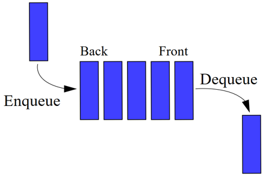
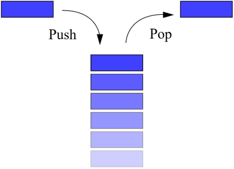
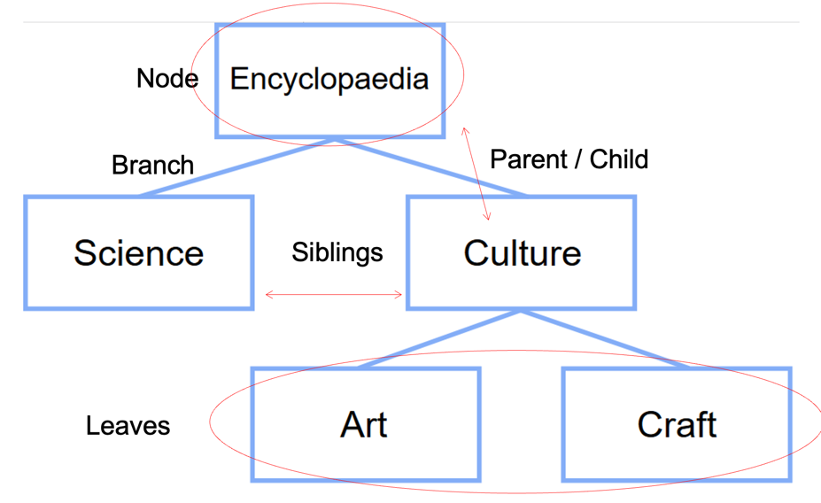
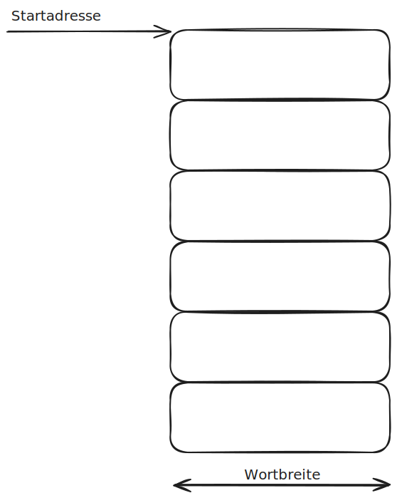
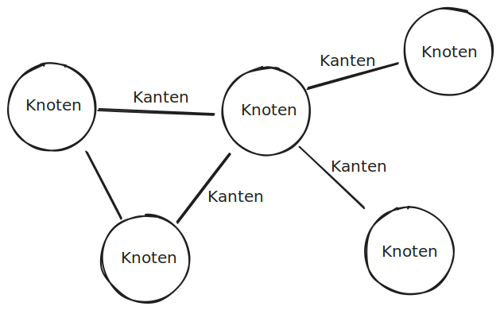

<!-- headingDivider: 3 -->

# Einstieg

## Softwareentwickler:innen bauen Maschinen

- Unsere Maschinen können nicht angefasst werden: Sie sind nicht materiell
- Wir sprechen von Programmen oder Systemen (Software)
- Um eine Softwaremaschine laufen zu lassen brauchen sie eine physische Maschine: den Computer (Hardware)

## Computer

- Computer sind universelle Maschinen. Sie führen die Programme aus, die wir ihnen füttern.
- Die einzigen Grenzen sind unsere Vorstellungskraft
- Gute Nachricht
    - Dein Computer macht genau das, was man ihm sagt.
    - Er macht es sehr schnell.
- Schlechte Nachricht
    - Dein Computer macht genau das, was man ihm sagt.
    - Er macht es sehr schnell.

## Programme erstellen und laufen lassen


## Programme erstellen und laufen lassen


## Programme erstellen und laufen lassen


## Verbreitete Mythen und Entschuldigungen

- «Computer sind intelligent»
    - Fakt: Computer sind weder intelligent noch dumm. Sie führen Programme aus, die von Menschen entwickelt wurden.
    - Diese Programme bilden die Intelligenz ihrer Autoren ab.
    - Die grundlegenden Computeroperationen sind elementar (Speichere diesen Wert, Addiere diese beiden Zahlen...)
- «Der Computer ist abgestürzt»
- [«Der Computer erlaubt das nicht»](https://youtu.be/0n_Ty_72Qds)
- «Der Computer hat ihren Datensatz verloren»

## Software schreiben ist herausfordernd

- Programme können «abstürzen»
- Programme, die nicht «abstürzen» funktionieren nicht zwangsläufig richtig.
- Fehlerhafte Programme können Menschen töten, (medizinische Geräte, Luftfahrt) → Boeing 737 MCAS
- Ariane5 Rakete, 1996: $10 Milliarden verloren aufgrund eines Programmfehlers.
- Programmierer sind veranwortlich für das korrekte Funktionieren der Programme
- Das Ziel dieses Fachs ist, nicht nur programmieren zu lernen, sondern gut programmieren zu lernen.

## Grundsätzliche Organisation

<!-- Bild -->

## Computer

- Computer sind universelle Maschinen, sie führen Programme aus, die wir ihnen "füttern"

<!-- Bild -->

## Informationen und Daten

- Information ist das, was wir Menschen wollen und verstehen, z.B. ein Lied oder einen Text
    - Interpretation von Daten für Menschen
- Daten bezeichnet, wie dies im Computer gespeichert wird, z.B. als MP3 Datei.
    - Ansammlung von Symbolen in einem Computer

## Informationen und Daten

- Daten werden gespeichert
- Eingabegeräte produzieren Daten aus Informationen
- Ausgabegeräte produzieren Informationen aus Daten

<!-- Bild -->

## Wo ist das Programm?

- Stored-program computer: Das Programm ist im Speicher
    - „ausführbare Daten“
- Ein Programm kann in verschiedenen Formen im Speicher auftreten:
    - Quellcode / Sourcecode: durch Menschen lesbare Form (Programmiersprache)
    - Maschinencode: Ausführbar durch Computer
- Compiler / Interpreter transformieren von Sourcecode zu Maschinencode
- Der Computer findet das Programm im Speicher und führt es aus.

## Software Engineering

Software sollte folgende Merkmale haben:

- Korrekt: Machen, was es sollte!
- Erweiterbar: Einfach zu ändern sein!
- Lesbar: durch Menschen!
- Wiederverwertbar: Das Rad nicht neu erfinden!
- Robust: Korrekt auf Fehler reagieren!
- Sicher: Angreifer abwehren!

## Software schreiben ist herausfordernd

- Es ist schwierig, das Programm korrekt zu schreiben
- Trial-and-error ist ineffizient

## Software schreiben macht Spass

- Entwickle deine eigene Maschine!
- Kreativität und Vorstellungsvermögen kann ausgelebt werden!
- Programme retten leben und machen die Welt besser!

# Entwicklungswerkzeuge

## Programmiersprachen


[Tiobe Index](https://www.tiobe.com/tiobe-index/)
[God-Tier Developer Roadmap](https://www.youtube.com/watch?v=pEfrdAtAmqk)

---

|            |      |                                |                 |                     |                                                       | Anwendungsgebiet                                                                      | Eigenschaften                                                                                                 |
|------------|------|--------------------------------|-----------------|---------------------|-------------------------------------------------------|---------------------------------------------------------------------------------------|---------------------------------------------------------------------------------------------------------------|
| C          | 1972 | Bell Labs                      | Kompiliert      | statisch typisiert  | imperativ, strukturiert                               | Betriebssystemen und Embedded                                                         | Sehr schnell und effizient                                                                                    |
| C++        | 1985 | Bell Labs                      | Kompiliert      | statisch typisiert  | imperativ, objektorientiert                           | Betriebssystemen, Desktop Applikationen, Games, Datenbanken, Interpreter              | Schnell und effizient, Hochkomplex                                                                            |
| Java       | 1995 | Sun                            | Kompiliert (VM) | statisch typisiert  | imperativ, objektorientiert                           | Enterprise Umfeld                                                                     | Virtuelle Maschine (Plattformunabhängig), Grosses Angebot an Bibliotheken und Werkzeugen, einfache Syntax    |
| C#         | 2000 | Microsoft                      | Kompiliert      | statisch typisiert  | imperativ, objektorientiert                           | Game Entwicklung (Unity), Microsoft Ökosystem, Enterprise Umfeld                      |                                                                                                               |
| Python     | 1991 | Centrum Wiskunde & Informatica | Interpretiert   | dynamisch typisiert | imperativ, strukturiert, objektorientiert             | Wissenschaften, Machine Learning, Big Data, Einsteiger, Automation                    | Einfache Syntax, grosses Angebot an Bibliotheken und Werkzeugen                                               |
| JavaScript | 1995 | Netscape                       | Interpretiert   | dynamisch typisiert | imperativ, objektorientiert                           | Web Frontend und Backend                                                              | Relativ performant, grosse Verbreitung, enorme Auswahl an Bibliotheken und Werkzeugen, Leistungsfähige Syntax |
| PHP        | 1995 | Rasmus Lerdorf                 | Interpretiert   | dynamisch typisiert | imperativ, strukturiert, objektorientiert             | Web                                                                                   |                                                                                                               |
| Go         | 2012 | Google                         | Kompiliert      | statisch typisiert  | imperativ, strukturiert, objektorientiert             | Web Backend, Tooling, DevOps                                                          | Keine Vererbung, Effizienz, Lesbarkeit / DX, Networking, Multiprocessing                                      |
| Rust       | 2015 | Mozilla                        | Kompiliert      | statisch typisiert  | imperativ, strukturiert, funktional, objektorientiert | Betriebssystemen, Desktop Applikationen, Games, Datenbanken, Interpreter, Web Backend | Keine Garbage Collection, Sicher, Nebenläufig Seit 2022 im Linux Kernel verwendet                             |

## Energy, Time, Memory Comparison


## Entwicklungsumgebungen


## Entwicklungsumgebungen

### Eclipse

- JavaScript/TypeScript, C/C++, PHP, Rust etc
- Open Source

### Microsoft Visual Studio

- VB, C, C++, C##, SQL, TypeScript, Python, HTML, JavaScript, CSS
- Closed Source

---

### Microsoft Visual Studio Code

- JavaScript, TypeScript, HTML, CSS, etc
- Open Source, Proprietär, frei

### JetBrains

- Java, Kotlin, Groovy, Scala, JavaScript, TypeScript, C (CLion), PHP (PHPStorm), Ruby (RubyMine), Python (PyCharm), iOS (AppCode), Android (AndroidStudio), C## (Rider)
- Teilweise OpenSource (Community Version)

## Jetbrains PyCharm


## Debugging


## Versionsverwaltung Basics

- Protokollierung von Änderungen
- Wiederherstellung von alten Ständen
- Archivierung
- Koordinierung des gemeinsamen Zugriffs
- Entwicklungszweige (Branches) -> [Don’t Branch!](https://www.youtube.com/watch?v=v4Ijkq6Myfc)

## Moderne Versionsverwaltung

- [CI/CD](https://www.redhat.com/cms/managed-files/ci-cd-flow-desktop_edited_0.png)
- [GitOps](https://www.atlassian.com/git/tutorials/gitops)
- [Infrastructure as Code](https://en.wikipedia.org/wiki/Infrastructure_as_code)
- Documentation as Code
    - [Markdown](https://www.markdownguide.org/)
    - [MKDocs](https://www.mkdocs.org/)
    - [PlantUML](https://plantuml.com/de/)
- Everything as Code

## [Git](https://git-scm.com/downloads)

- Fast jede Funktion arbeitet lokal -> Repository wird repliziert
- Optimistic Locking
- Git stellt Integrität sicher
- [Git fügt im Regelfall nur Daten hinzu](https://git-scm.com/book/de/v2/Erste-Schritte-Was-ist-Git%3F)
- Snapshots statt Unterschiede
  

## Die drei Zustände

- Modified
- Staged
- Committed
  

## Arbeiten mit Git

### Initialisieren

- Auf Github oder Gitlab ein leeres Projekt erstellen
- [Dieses Projekt lokal klonen](https://git-scm.com/docs/git-clone) `git clone`
- User name setzen: `git config user.name <name>`

---

### Arbeitsablauf

- [Lokales Repository aktualisieren](https://git-scm.com/docs/git-pull) `git pull origin`
- Source Dateien erstellen oder editieren
- [Änderungen zum Staging Area hinzufügen](https://git-scm.com/docs/git-add) `git add <directory>` (z.B. ".")
- [Änderungen im Repository festhalten](https://git-scm.com/docs/git-commit)
  `git commit -m "<message>"` (z.B. "change data type")
- [Lokales Repository aktualisieren](https://git-scm.com/docs/git-pull) `git pull <remote>` (z.B. "origin")
    - Mit Rebase bleibt die History aufgeräumter: `git pull --rebase`
- [Änderungen auf Github/Gitlab/Bitbucket laden](https://git-scm.com/docs/git-push) `git push <remote> <branch>` (z.B. "
  origin main")

## CI/CD mit Git

- Tests und Linter werden bei Commit automatisch ausgeführt und Commit ggf. abgelehnt.
- Mit Tags werden Releases markiert. [semantic versioning](https://semver.org/).
- Das neuste Release wird automatisch deployed.
- [Changelogs werden automatisiert anhand der Git Messages generiert](https://medium.com/agoda-engineering/automating-versioning-and-releases-using-semantic-release-6ed355ede742)

## Commit Messages

- [Your Git Commit History Should Read Like a History Book](https://betterprogramming.pub/your-git-commit-history-should-read-like-a-history-book-heres-how-7f44d5df1801)

```
feat(logging): added logs for failed signups
fix(homepage): fixed image gallery
test(homepage): updated tests
docs(readme): added new logging table information
```

## PyCharm Git Integration


---


## Ressourcen

- [Cheatsheet](https://www.atlassian.com/git/tutorials/atlassian-git-cheatsheet)
- [Atlassian Tutorials](https://www.atlassian.com/git/tutorials/what-is-version-control)
- [Git Tutorials](https://git-scm.com/book/de/v2/Erste-Schritte-Was-ist-Git%3F)
- [Simulationstool](https://learngitbranching.js.org/)

## Github / Gitlab

- Git Server
- CI/CD Plattform
- Issue Tracking / Projektmanagemetn
- Dokumentation
- Webhosting
- Release Management

---

### CI/CD Plattform


---

### Issue Tracking


---

# Algorithmen und Datenstrukturen

## Containerdatenstrukturen

- Enthalten andere Objekte («items»)
- Grundsätzliche Operationen:
    - Elemente hinzufügen
    - Elemente entfernen
    - Ein Element suchen
    - Über alle Elemente iterieren
- Verschiedene Implementationen unterscheiden sich
    - Welche Operationen möglich sind
    - Wie schnell diese sind
    - Wie der Speicher ausgenutzt wird

## Record

- Einfachste Anordnung von Daten
- Zeile in Datenbank / Tabelle
- Datenobjekte

### Beispiele

```C
// C
struct date {
  int year;
  int month;
  int day;
}
```

```python
# python
tup1 = ('physics', 'chemistry', 1997, 2000)
```

## Set

- Anordnung von Elementen
- keine Duplikate
- keine definierte Ordnung
- testen, ob Teil des Sets

### Beispiel

```python
# python
thisset = {"apple", "banana", "cherry"}
```

## List

- Definierte Ordnung
- Elemente hinzufügen und entfernen
- Element mit einem Index abrufen
- Duplikate möglich
-

### Beispiel

```python
# python
list2 = [1, 2, 3, 4, 5, 6, 7]
first_item = list2[0]  # select first item
list2[1:5]  # select items 2 to 6
```

## Map

- Schlüssel / Wert Paare
- Hinzufügen, Entfernen, Ändern, Abrufen
- Assoziatives Array, Lookup Table, Dictionary

### Beispiel

```python
# python
dict = {'Name': 'Zara', 'Age': 7, 'Class': 'First'}
dict['Name']  # Zara
```

## Queue

- FIFO: First In, First Out
- Warteschlange, Pipe
  

## Stack

- LIFO: Last In, First Out
- push: Neues Element speichern
- pop: Letztes Element abrufen und entfernen
- Stapelspeicher, Kellerspeicher
  

## Stack


## Tree



---


## Konkrete Datenstrukturen: Array



## Konkrete Datenstrukturen: Graph



## Komplexität von Algorithmen

### Speicher und Rechenaufwand von Datenstrukturen


### Big O Notation

 [Big O Cheatsheet](https://www.bigocheatsheet.com/)

- O(1): Operation dauert immer gleich lange, unabhängig von der Anzahl der Elemente
- O(n): Operation ist linear abhängig von der Anzahl der Elemente (Je mehr Elemente in der Liste, desto länger dauert die Operation)

### Alternative Big O Notation

|         |          |
|---------|----------|
| O(1)    | O(yeah)  |
| O(logn) | O(nice)  |
| O(n)    | O(k)     |
| O(n^2)  | O(my)    |
| O(2^n)  | O(no)    |
| O(n!)   | O(mg)    |
| O(n^n)  | O(sh*t!) |

https://quanticdev.com/algorithms/primitives/alternative-big-o-notation/

# Clean Code

[https://cleancoders.com/](https://cleancoders.com/)
[Clean Code: A Handbook of Agile Software Craftsmanship](https://www.amazon.com/Clean-Code-Handbook-Software-Craftsmanship/dp/0132350882)

## Bezeichner

> There are only two hard things in Computer Science: cache invalidation and naming things.
> -- Phil Karlton

## Bezeichner

- Zweck erkennbar
- Keine Falschinformation
- Unterscheidbar
- Aussprechbar
- Suchbar
- Klassen: Nomen
- Methoden: Verben
- Länge dem Scope entsprechend

## Funktionen

- Kurz!
- Machen nur etwas
- Keine Nebenwirkungen
- Höchstens 3 Parameter
- Don't Repeat Yourself

## Kommentare

- Code sollte selbsterklärend sein
- Informativ
- Absicht erklären
- Erläuterung
- Warnung
- Todo

# Fehlerbehandlung

- Es gibt Bedingungen, die erfüllt werden müssen, damit eine Methode überhaupt korrekt funktionieren kann.
- Oftmals gibt es beim Nichterfüllen kein sinnvolles weiteres Vorgehen, es handelt sich um einen Fehler.

## Arten von Fehlerbehandlung

- Fehler über Rückgabewerte zu kommunizieren funktioniert nur sinnvoll, wenn mehrere Rückgabewerte möglich sind: (Go)

```go
swagger, err := api.GetSwagger()
if err != nil {
    fmt.Fprintf(os.Stderr, "Error loading swagger spec\n: %s", err)
    os.Exit(1)
}
```

- Viele Sprachen unterstützen das Konzept der "Exceptions":

```javascript
  if (!(new.target)) {
    throw new Error("Constructor called as a function");
}
```

## Fehlerbehandlung

- Ausnahmen (Fehler) werden beim Auftreten geworfen (throw) und können gefangen (catch) werden.
- Exceptions werden weitergereicht bis sie gefangen werden.
- Werden sie bis zur `main` Methode nicht gefangen, stürzt das Programm ab.
- Exceptions, die im normalen Programmablauf auftreten können (z.B. Fehlerhafter User Input, Netzwerkverbindung offline)
  müssen gefangen und behandelt werden.
- Exceptions aufgrund von einem Programmierfehler sollten nicht gefangen werden.
- Code für die Fehlerbehandlung sollte möglichst vom Code der Funktionalität getrennt werden.

## Exceptions in Python

- Werfen von Exceptions: `raise Exception('<error message>')`
- Fangen von Exceptions:

```python
try:
    foo()  ## method that might raise an exception
except:
## handle exception
```

## Exceptions in Go

Exceptions können es schwierig machen, den Programmablauf nachzuvollziehen, weil Exceptions den normalen Programmablauf unterbrechen. In Go müssen, anders als in anderen Sprachen, Fehler als Rückgabewert explizit angegeben werden:

```
func (p Eurobox) setWeight(weight int) error {
	if weight <= 0 {
		return errors.New("Weight must be greater than zero")
	}
	p.weight = weight
	return nil
}
```


